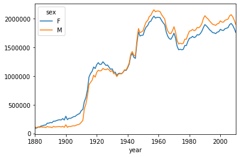
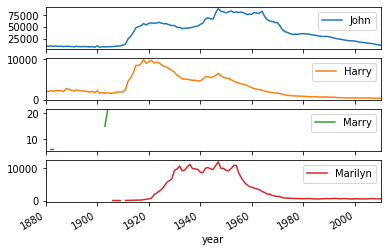
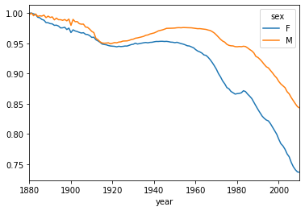
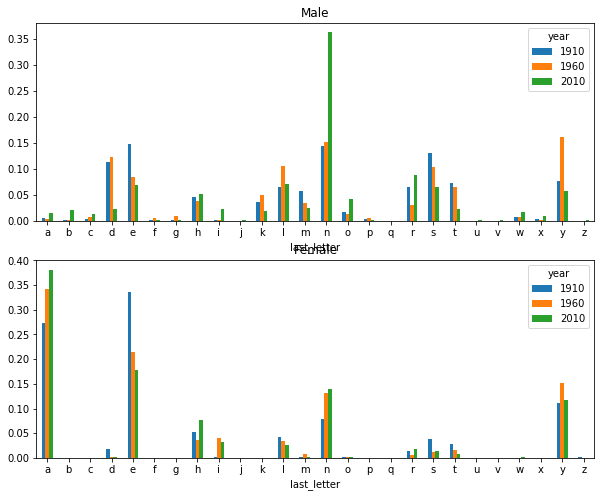
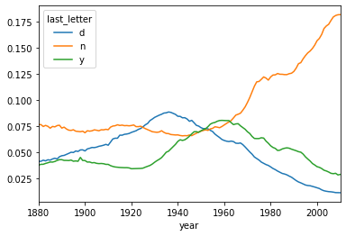

```python
import pandas as pd
import numpy as np
import matplotlib.pyplot as plt
%matplotlib inline

```


```python
names1880=pd.read_csv(r'D:\learning\PythonLearning\analysisData\Review&Test\pydata-book\datasets\babynames\yob1880.txt',
                      names=['name','sex','births'])
```


```python
names1880.head()
```


<div>
<style scoped>
    .dataframe tbody tr th:only-of-type {
        vertical-align: middle;
    }

    .dataframe tbody tr th {
        vertical-align: top;
    }

    .dataframe thead th {
        text-align: right;
    }
</style>
<table border="1" class="dataframe">
  <thead>
    <tr style="text-align: right;">
      <th></th>
      <th>name</th>
      <th>sex</th>
      <th>births</th>
    </tr>
  </thead>
  <tbody>
    <tr>
      <th>0</th>
      <td>Mary</td>
      <td>F</td>
      <td>7065</td>
    </tr>
    <tr>
      <th>1</th>
      <td>Anna</td>
      <td>F</td>
      <td>2604</td>
    </tr>
    <tr>
      <th>2</th>
      <td>Emma</td>
      <td>F</td>
      <td>2003</td>
    </tr>
    <tr>
      <th>3</th>
      <td>Elizabeth</td>
      <td>F</td>
      <td>1939</td>
    </tr>
    <tr>
      <th>4</th>
      <td>Minnie</td>
      <td>F</td>
      <td>1746</td>
    </tr>
  </tbody>
</table>
</div>


```python
names1880.groupby('sex')[['births']].sum()
```


<div>
<style scoped>
    .dataframe tbody tr th:only-of-type {
        vertical-align: middle;
    }

    .dataframe tbody tr th {
        vertical-align: top;
    }

    .dataframe thead th {
        text-align: right;
    }
</style>
<table border="1" class="dataframe">
  <thead>
    <tr style="text-align: right;">
      <th></th>
      <th>births</th>
    </tr>
    <tr>
      <th>sex</th>
      <th></th>
    </tr>
  </thead>
  <tbody>
    <tr>
      <th>F</th>
      <td>90993</td>
    </tr>
    <tr>
      <th>M</th>
      <td>110493</td>
    </tr>
  </tbody>
</table>
</div>


```python
years=range(1880,2011)
pieces=[]
columns=['name','sex','births']
for year in years:
    path=r'D:\learning\PythonLearning\analysisData\Review&Test\pydata-book\datasets\babynames\yob%d.txt'%year
    frame=pd.read_csv(path,names=columns)
    
    frame['year']=year
    pieces.append(frame)
```


```python
names=pd.concat(pieces,ignore_index=True)
```


```python
names.head()
```


<div>
<style scoped>
    .dataframe tbody tr th:only-of-type {
        vertical-align: middle;
    }

    .dataframe tbody tr th {
        vertical-align: top;
    }

    .dataframe thead th {
        text-align: right;
    }
</style>
<table border="1" class="dataframe">
  <thead>
    <tr style="text-align: right;">
      <th></th>
      <th>name</th>
      <th>sex</th>
      <th>births</th>
      <th>year</th>
    </tr>
  </thead>
  <tbody>
    <tr>
      <th>0</th>
      <td>Mary</td>
      <td>F</td>
      <td>7065</td>
      <td>1880</td>
    </tr>
    <tr>
      <th>1</th>
      <td>Anna</td>
      <td>F</td>
      <td>2604</td>
      <td>1880</td>
    </tr>
    <tr>
      <th>2</th>
      <td>Emma</td>
      <td>F</td>
      <td>2003</td>
      <td>1880</td>
    </tr>
    <tr>
      <th>3</th>
      <td>Elizabeth</td>
      <td>F</td>
      <td>1939</td>
      <td>1880</td>
    </tr>
    <tr>
      <th>4</th>
      <td>Minnie</td>
      <td>F</td>
      <td>1746</td>
      <td>1880</td>
    </tr>
  </tbody>
</table>
</div>


```python
total_births=names.pivot_table(values='births',index='year',columns='sex',aggfunc='sum')
```


```python
total_births
```


<div>
<style scoped>
    .dataframe tbody tr th:only-of-type {
        vertical-align: middle;
    }

    .dataframe tbody tr th {
        vertical-align: top;
    }

    .dataframe thead th {
        text-align: right;
    }
</style>
<table border="1" class="dataframe">
  <thead>
    <tr style="text-align: right;">
      <th>sex</th>
      <th>F</th>
      <th>M</th>
    </tr>
    <tr>
      <th>year</th>
      <th></th>
      <th></th>
    </tr>
  </thead>
  <tbody>
    <tr>
      <th>1880</th>
      <td>90993</td>
      <td>110493</td>
    </tr>
    <tr>
      <th>1881</th>
      <td>91955</td>
      <td>100748</td>
    </tr>
    <tr>
      <th>1882</th>
      <td>107851</td>
      <td>113687</td>
    </tr>
    <tr>
      <th>1883</th>
      <td>112322</td>
      <td>104632</td>
    </tr>
    <tr>
      <th>1884</th>
      <td>129021</td>
      <td>114445</td>
    </tr>
    <tr>
      <th>1885</th>
      <td>133056</td>
      <td>107802</td>
    </tr>
    <tr>
      <th>1886</th>
      <td>144538</td>
      <td>110785</td>
    </tr>
    <tr>
      <th>1887</th>
      <td>145983</td>
      <td>101412</td>
    </tr>
    <tr>
      <th>1888</th>
      <td>178631</td>
      <td>120857</td>
    </tr>
    <tr>
      <th>1889</th>
      <td>178369</td>
      <td>110590</td>
    </tr>
    <tr>
      <th>1890</th>
      <td>190377</td>
      <td>111026</td>
    </tr>
    <tr>
      <th>1891</th>
      <td>185486</td>
      <td>101198</td>
    </tr>
    <tr>
      <th>1892</th>
      <td>212350</td>
      <td>122038</td>
    </tr>
    <tr>
      <th>1893</th>
      <td>212908</td>
      <td>112319</td>
    </tr>
    <tr>
      <th>1894</th>
      <td>222923</td>
      <td>115775</td>
    </tr>
    <tr>
      <th>1895</th>
      <td>233632</td>
      <td>117398</td>
    </tr>
    <tr>
      <th>1896</th>
      <td>237924</td>
      <td>119575</td>
    </tr>
    <tr>
      <th>1897</th>
      <td>234199</td>
      <td>112760</td>
    </tr>
    <tr>
      <th>1898</th>
      <td>258771</td>
      <td>122703</td>
    </tr>
    <tr>
      <th>1899</th>
      <td>233022</td>
      <td>106218</td>
    </tr>
    <tr>
      <th>1900</th>
      <td>299873</td>
      <td>150554</td>
    </tr>
    <tr>
      <th>1901</th>
      <td>239351</td>
      <td>106478</td>
    </tr>
    <tr>
      <th>1902</th>
      <td>264079</td>
      <td>122660</td>
    </tr>
    <tr>
      <th>1903</th>
      <td>261976</td>
      <td>119240</td>
    </tr>
    <tr>
      <th>1904</th>
      <td>275375</td>
      <td>128129</td>
    </tr>
    <tr>
      <th>1905</th>
      <td>291641</td>
      <td>132319</td>
    </tr>
    <tr>
      <th>1906</th>
      <td>295301</td>
      <td>133159</td>
    </tr>
    <tr>
      <th>1907</th>
      <td>318558</td>
      <td>146838</td>
    </tr>
    <tr>
      <th>1908</th>
      <td>334277</td>
      <td>154339</td>
    </tr>
    <tr>
      <th>1909</th>
      <td>347191</td>
      <td>163983</td>
    </tr>
    <tr>
      <th>...</th>
      <td>...</td>
      <td>...</td>
    </tr>
    <tr>
      <th>1981</th>
      <td>1666833</td>
      <td>1789568</td>
    </tr>
    <tr>
      <th>1982</th>
      <td>1692036</td>
      <td>1812642</td>
    </tr>
    <tr>
      <th>1983</th>
      <td>1669486</td>
      <td>1790670</td>
    </tr>
    <tr>
      <th>1984</th>
      <td>1682396</td>
      <td>1802735</td>
    </tr>
    <tr>
      <th>1985</th>
      <td>1719450</td>
      <td>1846162</td>
    </tr>
    <tr>
      <th>1986</th>
      <td>1714053</td>
      <td>1839442</td>
    </tr>
    <tr>
      <th>1987</th>
      <td>1737508</td>
      <td>1865113</td>
    </tr>
    <tr>
      <th>1988</th>
      <td>1779112</td>
      <td>1911858</td>
    </tr>
    <tr>
      <th>1989</th>
      <td>1843057</td>
      <td>1999840</td>
    </tr>
    <tr>
      <th>1990</th>
      <td>1897256</td>
      <td>2052070</td>
    </tr>
    <tr>
      <th>1991</th>
      <td>1874110</td>
      <td>2019018</td>
    </tr>
    <tr>
      <th>1992</th>
      <td>1842818</td>
      <td>1995760</td>
    </tr>
    <tr>
      <th>1993</th>
      <td>1807795</td>
      <td>1959712</td>
    </tr>
    <tr>
      <th>1994</th>
      <td>1784407</td>
      <td>1930363</td>
    </tr>
    <tr>
      <th>1995</th>
      <td>1757240</td>
      <td>1902100</td>
    </tr>
    <tr>
      <th>1996</th>
      <td>1751681</td>
      <td>1892700</td>
    </tr>
    <tr>
      <th>1997</th>
      <td>1739331</td>
      <td>1883571</td>
    </tr>
    <tr>
      <th>1998</th>
      <td>1765390</td>
      <td>1909676</td>
    </tr>
    <tr>
      <th>1999</th>
      <td>1772139</td>
      <td>1918267</td>
    </tr>
    <tr>
      <th>2000</th>
      <td>1813960</td>
      <td>1961702</td>
    </tr>
    <tr>
      <th>2001</th>
      <td>1798284</td>
      <td>1940498</td>
    </tr>
    <tr>
      <th>2002</th>
      <td>1794358</td>
      <td>1938941</td>
    </tr>
    <tr>
      <th>2003</th>
      <td>1824406</td>
      <td>1972439</td>
    </tr>
    <tr>
      <th>2004</th>
      <td>1833005</td>
      <td>1981557</td>
    </tr>
    <tr>
      <th>2005</th>
      <td>1843890</td>
      <td>1993285</td>
    </tr>
    <tr>
      <th>2006</th>
      <td>1896468</td>
      <td>2050234</td>
    </tr>
    <tr>
      <th>2007</th>
      <td>1916888</td>
      <td>2069242</td>
    </tr>
    <tr>
      <th>2008</th>
      <td>1883645</td>
      <td>2032310</td>
    </tr>
    <tr>
      <th>2009</th>
      <td>1827643</td>
      <td>1973359</td>
    </tr>
    <tr>
      <th>2010</th>
      <td>1759010</td>
      <td>1898382</td>
    </tr>
  </tbody>
</table>
<p>131 rows × 2 columns</p>
</div>


```python
total_births.plot()
```


    <matplotlib.axes._subplots.AxesSubplot at 0x1db20ae0748>





```python
def add_prop(group):
    group['prop']=group['births']/group['births'].sum()
    return group
names=names.groupby(['year','sex']).apply(add_prop)
```


```python
names.head()
```


<div>
<style scoped>
    .dataframe tbody tr th:only-of-type {
        vertical-align: middle;
    }

    .dataframe tbody tr th {
        vertical-align: top;
    }

    .dataframe thead th {
        text-align: right;
    }
</style>
<table border="1" class="dataframe">
  <thead>
    <tr style="text-align: right;">
      <th></th>
      <th>name</th>
      <th>sex</th>
      <th>births</th>
      <th>year</th>
      <th>prop</th>
    </tr>
  </thead>
  <tbody>
    <tr>
      <th>0</th>
      <td>Mary</td>
      <td>F</td>
      <td>7065</td>
      <td>1880</td>
      <td>0.077643</td>
    </tr>
    <tr>
      <th>1</th>
      <td>Anna</td>
      <td>F</td>
      <td>2604</td>
      <td>1880</td>
      <td>0.028618</td>
    </tr>
    <tr>
      <th>2</th>
      <td>Emma</td>
      <td>F</td>
      <td>2003</td>
      <td>1880</td>
      <td>0.022013</td>
    </tr>
    <tr>
      <th>3</th>
      <td>Elizabeth</td>
      <td>F</td>
      <td>1939</td>
      <td>1880</td>
      <td>0.021309</td>
    </tr>
    <tr>
      <th>4</th>
      <td>Minnie</td>
      <td>F</td>
      <td>1746</td>
      <td>1880</td>
      <td>0.019188</td>
    </tr>
  </tbody>
</table>
</div>


```python
def get_top1000(df):
    return  df.sort_values(by='births',ascending=False)[:1000]
top1000=names.groupby(['year','sex']).apply(get_top1000)

```


```python
top1000.head()
```


<div>
<style scoped>
    .dataframe tbody tr th:only-of-type {
        vertical-align: middle;
    }

    .dataframe tbody tr th {
        vertical-align: top;
    }

    .dataframe thead th {
        text-align: right;
    }
</style>
<table border="1" class="dataframe">
  <thead>
    <tr style="text-align: right;">
      <th></th>
      <th></th>
      <th></th>
      <th>name</th>
      <th>sex</th>
      <th>births</th>
      <th>year</th>
      <th>prop</th>
    </tr>
    <tr>
      <th>year</th>
      <th>sex</th>
      <th></th>
      <th></th>
      <th></th>
      <th></th>
      <th></th>
      <th></th>
    </tr>
  </thead>
  <tbody>
    <tr>
      <th rowspan="5" valign="top">1880</th>
      <th rowspan="5" valign="top">F</th>
      <th>0</th>
      <td>Mary</td>
      <td>F</td>
      <td>7065</td>
      <td>1880</td>
      <td>0.077643</td>
    </tr>
    <tr>
      <th>1</th>
      <td>Anna</td>
      <td>F</td>
      <td>2604</td>
      <td>1880</td>
      <td>0.028618</td>
    </tr>
    <tr>
      <th>2</th>
      <td>Emma</td>
      <td>F</td>
      <td>2003</td>
      <td>1880</td>
      <td>0.022013</td>
    </tr>
    <tr>
      <th>3</th>
      <td>Elizabeth</td>
      <td>F</td>
      <td>1939</td>
      <td>1880</td>
      <td>0.021309</td>
    </tr>
    <tr>
      <th>4</th>
      <td>Minnie</td>
      <td>F</td>
      <td>1746</td>
      <td>1880</td>
      <td>0.019188</td>
    </tr>
  </tbody>
</table>
</div>


```python
#删除组索引，里面的列竟然还在，非常奇怪
top1000.reset_index(inplace=True,drop=True)
```


```python
top1000.head()
```


<div>
<style scoped>
    .dataframe tbody tr th:only-of-type {
        vertical-align: middle;
    }

    .dataframe tbody tr th {
        vertical-align: top;
    }

    .dataframe thead th {
        text-align: right;
    }
</style>
<table border="1" class="dataframe">
  <thead>
    <tr style="text-align: right;">
      <th></th>
      <th>name</th>
      <th>sex</th>
      <th>births</th>
      <th>year</th>
      <th>prop</th>
    </tr>
  </thead>
  <tbody>
    <tr>
      <th>0</th>
      <td>Mary</td>
      <td>F</td>
      <td>7065</td>
      <td>1880</td>
      <td>0.077643</td>
    </tr>
    <tr>
      <th>1</th>
      <td>Anna</td>
      <td>F</td>
      <td>2604</td>
      <td>1880</td>
      <td>0.028618</td>
    </tr>
    <tr>
      <th>2</th>
      <td>Emma</td>
      <td>F</td>
      <td>2003</td>
      <td>1880</td>
      <td>0.022013</td>
    </tr>
    <tr>
      <th>3</th>
      <td>Elizabeth</td>
      <td>F</td>
      <td>1939</td>
      <td>1880</td>
      <td>0.021309</td>
    </tr>
    <tr>
      <th>4</th>
      <td>Minnie</td>
      <td>F</td>
      <td>1746</td>
      <td>1880</td>
      <td>0.019188</td>
    </tr>
  </tbody>
</table>
</div>


```python
top1000.groupby('sex').sum()
```


<div>
<style scoped>
    .dataframe tbody tr th:only-of-type {
        vertical-align: middle;
    }

    .dataframe tbody tr th {
        vertical-align: top;
    }

    .dataframe thead th {
        text-align: right;
    }
</style>
<table border="1" class="dataframe">
  <thead>
    <tr style="text-align: right;">
      <th></th>
      <th>births</th>
      <th>year</th>
      <th>prop</th>
    </tr>
    <tr>
      <th>sex</th>
      <th></th>
      <th></th>
      <th></th>
    </tr>
  </thead>
  <tbody>
    <tr>
      <th>F</th>
      <td>143069617</td>
      <td>254569338</td>
      <td>120.195516</td>
    </tr>
    <tr>
      <th>M</th>
      <td>153120008</td>
      <td>254789357</td>
      <td>125.117735</td>
    </tr>
  </tbody>
</table>
</div>


```python
boys=top1000[top1000['sex']=='M']
girls=top1000[top1000['sex']=='F']
total_births=top1000.pivot_table(values='births',index='year',columns='name',aggfunc='sum')
```


```python
total_births.info()
```

    <class 'pandas.core.frame.DataFrame'>
    Int64Index: 131 entries, 1880 to 2010
    Columns: 6868 entries, Aaden to Zuri
    dtypes: float64(6868)
    memory usage: 6.9 MB
    


```python
subset=total_births[['John','Harry','Marry','Marilyn']]
```


```python
subset.plot(subplots=True)
```


    array([<matplotlib.axes._subplots.AxesSubplot object at 0x000001DB200ED748>,
           <matplotlib.axes._subplots.AxesSubplot object at 0x000001DB24E0B940>,
           <matplotlib.axes._subplots.AxesSubplot object at 0x000001DB24E37F98>,
           <matplotlib.axes._subplots.AxesSubplot object at 0x000001DB24E73438>],
          dtype=object)





```python
top1000.head()
```


<div>
<style scoped>
    .dataframe tbody tr th:only-of-type {
        vertical-align: middle;
    }

    .dataframe tbody tr th {
        vertical-align: top;
    }

    .dataframe thead th {
        text-align: right;
    }
</style>
<table border="1" class="dataframe">
  <thead>
    <tr style="text-align: right;">
      <th></th>
      <th>name</th>
      <th>sex</th>
      <th>births</th>
      <th>year</th>
      <th>prop</th>
    </tr>
  </thead>
  <tbody>
    <tr>
      <th>0</th>
      <td>Mary</td>
      <td>F</td>
      <td>7065</td>
      <td>1880</td>
      <td>0.077643</td>
    </tr>
    <tr>
      <th>1</th>
      <td>Anna</td>
      <td>F</td>
      <td>2604</td>
      <td>1880</td>
      <td>0.028618</td>
    </tr>
    <tr>
      <th>2</th>
      <td>Emma</td>
      <td>F</td>
      <td>2003</td>
      <td>1880</td>
      <td>0.022013</td>
    </tr>
    <tr>
      <th>3</th>
      <td>Elizabeth</td>
      <td>F</td>
      <td>1939</td>
      <td>1880</td>
      <td>0.021309</td>
    </tr>
    <tr>
      <th>4</th>
      <td>Minnie</td>
      <td>F</td>
      <td>1746</td>
      <td>1880</td>
      <td>0.019188</td>
    </tr>
  </tbody>
</table>
</div>


```python
table=top1000.pivot_table(values='prop',index='year',columns='sex',aggfunc='sum')
```


```python
table.head()
```


<div>
<style scoped>
    .dataframe tbody tr th:only-of-type {
        vertical-align: middle;
    }

    .dataframe tbody tr th {
        vertical-align: top;
    }

    .dataframe thead th {
        text-align: right;
    }
</style>
<table border="1" class="dataframe">
  <thead>
    <tr style="text-align: right;">
      <th>sex</th>
      <th>F</th>
      <th>M</th>
    </tr>
    <tr>
      <th>year</th>
      <th></th>
      <th></th>
    </tr>
  </thead>
  <tbody>
    <tr>
      <th>1880</th>
      <td>1.000000</td>
      <td>0.997375</td>
    </tr>
    <tr>
      <th>1881</th>
      <td>1.000000</td>
      <td>1.000000</td>
    </tr>
    <tr>
      <th>1882</th>
      <td>0.998702</td>
      <td>0.995646</td>
    </tr>
    <tr>
      <th>1883</th>
      <td>0.997596</td>
      <td>0.998566</td>
    </tr>
    <tr>
      <th>1884</th>
      <td>0.993156</td>
      <td>0.994539</td>
    </tr>
  </tbody>
</table>
</div>


```python
table.plot()
```


    <matplotlib.axes._subplots.AxesSubplot at 0x1db24f3dd68>





```python
df=boys[boys['year']==2010]
```


```python
df.head()
```


<div>
<style scoped>
    .dataframe tbody tr th:only-of-type {
        vertical-align: middle;
    }

    .dataframe tbody tr th {
        vertical-align: top;
    }

    .dataframe thead th {
        text-align: right;
    }
</style>
<table border="1" class="dataframe">
  <thead>
    <tr style="text-align: right;">
      <th></th>
      <th>name</th>
      <th>sex</th>
      <th>births</th>
      <th>year</th>
      <th>prop</th>
    </tr>
  </thead>
  <tbody>
    <tr>
      <th>260877</th>
      <td>Jacob</td>
      <td>M</td>
      <td>21875</td>
      <td>2010</td>
      <td>0.011523</td>
    </tr>
    <tr>
      <th>260878</th>
      <td>Ethan</td>
      <td>M</td>
      <td>17866</td>
      <td>2010</td>
      <td>0.009411</td>
    </tr>
    <tr>
      <th>260879</th>
      <td>Michael</td>
      <td>M</td>
      <td>17133</td>
      <td>2010</td>
      <td>0.009025</td>
    </tr>
    <tr>
      <th>260880</th>
      <td>Jayden</td>
      <td>M</td>
      <td>17030</td>
      <td>2010</td>
      <td>0.008971</td>
    </tr>
    <tr>
      <th>260881</th>
      <td>William</td>
      <td>M</td>
      <td>16870</td>
      <td>2010</td>
      <td>0.008887</td>
    </tr>
  </tbody>
</table>
</div>


```python
prop_cumsum=df.sort_values(by='prop',ascending=False)['prop'].cumsum()
```


```python
prop_cumsum.head()

```


    260877    0.011523
    260878    0.020934
    260879    0.029959
    260880    0.038930
    260881    0.047817
    Name: prop, dtype: float64


```python
#这个可以找到series中的到0.5位置
prop_cumsum.values.searchsorted(0.5)
```


    116


```python
names.head()
```


<div>
<style scoped>
    .dataframe tbody tr th:only-of-type {
        vertical-align: middle;
    }

    .dataframe tbody tr th {
        vertical-align: top;
    }

    .dataframe thead th {
        text-align: right;
    }
</style>
<table border="1" class="dataframe">
  <thead>
    <tr style="text-align: right;">
      <th></th>
      <th>name</th>
      <th>sex</th>
      <th>births</th>
      <th>year</th>
      <th>prop</th>
    </tr>
  </thead>
  <tbody>
    <tr>
      <th>0</th>
      <td>Mary</td>
      <td>F</td>
      <td>7065</td>
      <td>1880</td>
      <td>0.077643</td>
    </tr>
    <tr>
      <th>1</th>
      <td>Anna</td>
      <td>F</td>
      <td>2604</td>
      <td>1880</td>
      <td>0.028618</td>
    </tr>
    <tr>
      <th>2</th>
      <td>Emma</td>
      <td>F</td>
      <td>2003</td>
      <td>1880</td>
      <td>0.022013</td>
    </tr>
    <tr>
      <th>3</th>
      <td>Elizabeth</td>
      <td>F</td>
      <td>1939</td>
      <td>1880</td>
      <td>0.021309</td>
    </tr>
    <tr>
      <th>4</th>
      <td>Minnie</td>
      <td>F</td>
      <td>1746</td>
      <td>1880</td>
      <td>0.019188</td>
    </tr>
  </tbody>
</table>
</div>


```python
names['last_letter']=names['name'].str.get(-1)
```


```python
names.head()
```


<div>
<style scoped>
    .dataframe tbody tr th:only-of-type {
        vertical-align: middle;
    }

    .dataframe tbody tr th {
        vertical-align: top;
    }

    .dataframe thead th {
        text-align: right;
    }
</style>
<table border="1" class="dataframe">
  <thead>
    <tr style="text-align: right;">
      <th></th>
      <th>name</th>
      <th>sex</th>
      <th>births</th>
      <th>year</th>
      <th>prop</th>
      <th>last_letter</th>
    </tr>
  </thead>
  <tbody>
    <tr>
      <th>0</th>
      <td>Mary</td>
      <td>F</td>
      <td>7065</td>
      <td>1880</td>
      <td>0.077643</td>
      <td>y</td>
    </tr>
    <tr>
      <th>1</th>
      <td>Anna</td>
      <td>F</td>
      <td>2604</td>
      <td>1880</td>
      <td>0.028618</td>
      <td>a</td>
    </tr>
    <tr>
      <th>2</th>
      <td>Emma</td>
      <td>F</td>
      <td>2003</td>
      <td>1880</td>
      <td>0.022013</td>
      <td>a</td>
    </tr>
    <tr>
      <th>3</th>
      <td>Elizabeth</td>
      <td>F</td>
      <td>1939</td>
      <td>1880</td>
      <td>0.021309</td>
      <td>h</td>
    </tr>
    <tr>
      <th>4</th>
      <td>Minnie</td>
      <td>F</td>
      <td>1746</td>
      <td>1880</td>
      <td>0.019188</td>
      <td>e</td>
    </tr>
  </tbody>
</table>
</div>


```python
table=names.pivot_table(values='births',index='last_letter',columns=['sex','year'],aggfunc='sum',margins=True)
```


```python
#使用reindex进行选择,而且这里数字不能打引号
subtable=table.reindex(columns=[1910,1960,2010],level='year')
```


```python
subtable.head()
```


<div>
<style scoped>
    .dataframe tbody tr th:only-of-type {
        vertical-align: middle;
    }

    .dataframe tbody tr th {
        vertical-align: top;
    }

    .dataframe thead tr th {
        text-align: left;
    }

    .dataframe thead tr:last-of-type th {
        text-align: right;
    }
</style>
<table border="1" class="dataframe">
  <thead>
    <tr>
      <th>sex</th>
      <th colspan="3" halign="left">F</th>
      <th colspan="3" halign="left">M</th>
    </tr>
    <tr>
      <th>year</th>
      <th>1910</th>
      <th>1960</th>
      <th>2010</th>
      <th>1910</th>
      <th>1960</th>
      <th>2010</th>
    </tr>
    <tr>
      <th>last_letter</th>
      <th></th>
      <th></th>
      <th></th>
      <th></th>
      <th></th>
      <th></th>
    </tr>
  </thead>
  <tbody>
    <tr>
      <th>a</th>
      <td>108376.0</td>
      <td>691247.0</td>
      <td>670605.0</td>
      <td>977.0</td>
      <td>5204.0</td>
      <td>28438.0</td>
    </tr>
    <tr>
      <th>b</th>
      <td>NaN</td>
      <td>694.0</td>
      <td>450.0</td>
      <td>411.0</td>
      <td>3912.0</td>
      <td>38859.0</td>
    </tr>
    <tr>
      <th>c</th>
      <td>5.0</td>
      <td>49.0</td>
      <td>946.0</td>
      <td>482.0</td>
      <td>15476.0</td>
      <td>23125.0</td>
    </tr>
    <tr>
      <th>d</th>
      <td>6750.0</td>
      <td>3729.0</td>
      <td>2607.0</td>
      <td>22111.0</td>
      <td>262112.0</td>
      <td>44398.0</td>
    </tr>
    <tr>
      <th>e</th>
      <td>133569.0</td>
      <td>435013.0</td>
      <td>313833.0</td>
      <td>28655.0</td>
      <td>178823.0</td>
      <td>129012.0</td>
    </tr>
  </tbody>
</table>
</div>


```python
#这里会用列来进行加总，也就是说，索引不会分组，进行加总，在对透视表进行操作时候
subtable.sum()
```


```python
letter_prop=subtable/subtable.sum()
```


```python
letter_prop.sum()
```


    sex  year
    F    1910    1.0
         1960    1.0
         2010    1.0
    M    1910    1.0
         1960    1.0
         2010    1.0
    dtype: float64


```python
#这这里非常重要，揭示了切片问题，在高层索引中，loc是采用，先索引，再列切片，而普通切片，是先列再索引，记住了,尽量采用Loc更加规范
letter_prop.loc[['a'],'M']
```


<div>
<style scoped>
    .dataframe tbody tr th:only-of-type {
        vertical-align: middle;
    }

    .dataframe tbody tr th {
        vertical-align: top;
    }

    .dataframe thead th {
        text-align: right;
    }
</style>
<table border="1" class="dataframe">
  <thead>
    <tr style="text-align: right;">
      <th>year</th>
      <th>1910</th>
      <th>1960</th>
      <th>2010</th>
    </tr>
    <tr>
      <th>last_letter</th>
      <th></th>
      <th></th>
      <th></th>
    </tr>
  </thead>
  <tbody>
    <tr>
      <th>a</th>
      <td>0.005031</td>
      <td>0.00244</td>
      <td>0.01498</td>
    </tr>
  </tbody>
</table>
</div>


```python
#这里意思是，只能切片两层，多层受不了，而且索引如果不选，要空出来
letter_prop.loc[:,'M'].loc[:,1910]
```


    last_letter
    a    0.005031
    b    0.002116
    c    0.002482
    d    0.113858
    e    0.147556
    f    0.000783
    g    0.002250
    h    0.045562
    i    0.000844
    j         NaN
    k    0.036581
    l    0.065016
    m    0.058044
    n    0.143415
    o    0.017065
    p    0.003172
    q         NaN
    r    0.064481
    s    0.130815
    t    0.072879
    u    0.000124
    v    0.000113
    w    0.006329
    x    0.003965
    y    0.077349
    z    0.000170
    Name: 1910, dtype: float64


```python
#要一层一层选
letter_prop.loc[:,1910]
```


    ---------------------------------------------------------------------------

    KeyError                                  Traceback (most recent call last)

    D:\software\Anaconda\envs\data\lib\site-packages\pandas\core\indexes\base.py in get_loc(self, key, method, tolerance)
       2656             try:
    -> 2657                 return self._engine.get_loc(key)
       2658             except KeyError:
    

    pandas/_libs/index.pyx in pandas._libs.index.IndexEngine.get_loc()
    

    pandas/_libs/index.pyx in pandas._libs.index.IndexEngine.get_loc()
    

    pandas/_libs/hashtable_class_helper.pxi in pandas._libs.hashtable.PyObjectHashTable.get_item()
    

    pandas/_libs/hashtable_class_helper.pxi in pandas._libs.hashtable.PyObjectHashTable.get_item()
    

    KeyError: 1910

    
    During handling of the above exception, another exception occurred:
    

    KeyError                                  Traceback (most recent call last)

    <ipython-input-110-62861ebc7828> in <module>
    ----> 1 letter_prop.loc[:,1910]
    

    D:\software\Anaconda\envs\data\lib\site-packages\pandas\core\indexing.py in __getitem__(self, key)
       1492             except (KeyError, IndexError, AttributeError):
       1493                 pass
    -> 1494             return self._getitem_tuple(key)
       1495         else:
       1496             # we by definition only have the 0th axis
    

    D:\software\Anaconda\envs\data\lib\site-packages\pandas\core\indexing.py in _getitem_tuple(self, tup)
        866     def _getitem_tuple(self, tup):
        867         try:
    --> 868             return self._getitem_lowerdim(tup)
        869         except IndexingError:
        870             pass
    

    D:\software\Anaconda\envs\data\lib\site-packages\pandas\core\indexing.py in _getitem_lowerdim(self, tup)
        967         # we may have a nested tuples indexer here
        968         if self._is_nested_tuple_indexer(tup):
    --> 969             return self._getitem_nested_tuple(tup)
        970 
        971         # we maybe be using a tuple to represent multiple dimensions here
    

    D:\software\Anaconda\envs\data\lib\site-packages\pandas\core\indexing.py in _getitem_nested_tuple(self, tup)
       1046 
       1047             current_ndim = obj.ndim
    -> 1048             obj = getattr(obj, self.name)._getitem_axis(key, axis=axis)
       1049             axis += 1
       1050 
    

    D:\software\Anaconda\envs\data\lib\site-packages\pandas\core\indexing.py in _getitem_axis(self, key, axis)
       1911         # fall thru to straight lookup
       1912         self._validate_key(key, axis)
    -> 1913         return self._get_label(key, axis=axis)
       1914 
       1915 
    

    D:\software\Anaconda\envs\data\lib\site-packages\pandas\core\indexing.py in _get_label(self, label, axis)
        139             raise IndexingError('no slices here, handle elsewhere')
        140 
    --> 141         return self.obj._xs(label, axis=axis)
        142 
        143     def _get_loc(self, key, axis=None):
    

    D:\software\Anaconda\envs\data\lib\site-packages\pandas\core\generic.py in xs(self, key, axis, level, drop_level)
       3574 
       3575         if axis == 1:
    -> 3576             return self[key]
       3577 
       3578         self._consolidate_inplace()
    

    D:\software\Anaconda\envs\data\lib\site-packages\pandas\core\frame.py in __getitem__(self, key)
       2924         if is_single_key:
       2925             if self.columns.nlevels > 1:
    -> 2926                 return self._getitem_multilevel(key)
       2927             indexer = self.columns.get_loc(key)
       2928             if is_integer(indexer):
    

    D:\software\Anaconda\envs\data\lib\site-packages\pandas\core\frame.py in _getitem_multilevel(self, key)
       2970 
       2971     def _getitem_multilevel(self, key):
    -> 2972         loc = self.columns.get_loc(key)
       2973         if isinstance(loc, (slice, Series, np.ndarray, Index)):
       2974             new_columns = self.columns[loc]
    

    D:\software\Anaconda\envs\data\lib\site-packages\pandas\core\indexes\multi.py in get_loc(self, key, method)
       2395 
       2396         if not isinstance(key, tuple):
    -> 2397             loc = self._get_level_indexer(key, level=0)
       2398             return _maybe_to_slice(loc)
       2399 
    

    D:\software\Anaconda\envs\data\lib\site-packages\pandas\core\indexes\multi.py in _get_level_indexer(self, key, level, indexer)
       2650         else:
       2651 
    -> 2652             code = level_index.get_loc(key)
       2653 
       2654             if level > 0 or self.lexsort_depth == 0:
    

    D:\software\Anaconda\envs\data\lib\site-packages\pandas\core\indexes\base.py in get_loc(self, key, method, tolerance)
       2657                 return self._engine.get_loc(key)
       2658             except KeyError:
    -> 2659                 return self._engine.get_loc(self._maybe_cast_indexer(key))
       2660         indexer = self.get_indexer([key], method=method, tolerance=tolerance)
       2661         if indexer.ndim > 1 or indexer.size > 1:
    

    pandas/_libs/index.pyx in pandas._libs.index.IndexEngine.get_loc()
    

    pandas/_libs/index.pyx in pandas._libs.index.IndexEngine.get_loc()
    

    pandas/_libs/hashtable_class_helper.pxi in pandas._libs.hashtable.PyObjectHashTable.get_item()
    

    pandas/_libs/hashtable_class_helper.pxi in pandas._libs.hashtable.PyObjectHashTable.get_item()
    

    KeyError: 1910


```python
#这里就是画图经验了，如果是多图，就创建子图，然后用ax参数设置位置
fig,axes=plt.subplots(nrows=2,ncols=1,figsize=(10,8))
letter_prop['M'].plot(kind='bar',rot=0,ax=axes[0],title='Male')
letter_prop['F'].plot(kind='bar',rot=0,ax=axes[1],title='Female')
```


    <matplotlib.axes._subplots.AxesSubplot at 0x1db25447b70>





```python
table.head()
```


<div>
<style scoped>
    .dataframe tbody tr th:only-of-type {
        vertical-align: middle;
    }

    .dataframe tbody tr th {
        vertical-align: top;
    }

    .dataframe thead tr th {
        text-align: left;
    }

    .dataframe thead tr:last-of-type th {
        text-align: right;
    }
</style>
<table border="1" class="dataframe">
  <thead>
    <tr>
      <th>sex</th>
      <th colspan="10" halign="left">F</th>
      <th>...</th>
      <th colspan="9" halign="left">M</th>
      <th>All</th>
    </tr>
    <tr>
      <th>year</th>
      <th>1880</th>
      <th>1881</th>
      <th>1882</th>
      <th>1883</th>
      <th>1884</th>
      <th>1885</th>
      <th>1886</th>
      <th>1887</th>
      <th>1888</th>
      <th>1889</th>
      <th>...</th>
      <th>2002</th>
      <th>2003</th>
      <th>2004</th>
      <th>2005</th>
      <th>2006</th>
      <th>2007</th>
      <th>2008</th>
      <th>2009</th>
      <th>2010</th>
      <th></th>
    </tr>
    <tr>
      <th>last_letter</th>
      <th></th>
      <th></th>
      <th></th>
      <th></th>
      <th></th>
      <th></th>
      <th></th>
      <th></th>
      <th></th>
      <th></th>
      <th></th>
      <th></th>
      <th></th>
      <th></th>
      <th></th>
      <th></th>
      <th></th>
      <th></th>
      <th></th>
      <th></th>
      <th></th>
    </tr>
  </thead>
  <tbody>
    <tr>
      <th>a</th>
      <td>31446.0</td>
      <td>31581.0</td>
      <td>36536.0</td>
      <td>38330.0</td>
      <td>43680.0</td>
      <td>45408.0</td>
      <td>49100.0</td>
      <td>48942.0</td>
      <td>59442.0</td>
      <td>58631.0</td>
      <td>...</td>
      <td>38815.0</td>
      <td>37825.0</td>
      <td>38650.0</td>
      <td>36838.0</td>
      <td>36156.0</td>
      <td>34654.0</td>
      <td>32901.0</td>
      <td>31430.0</td>
      <td>28438.0</td>
      <td>55876394</td>
    </tr>
    <tr>
      <th>b</th>
      <td>NaN</td>
      <td>NaN</td>
      <td>NaN</td>
      <td>NaN</td>
      <td>NaN</td>
      <td>NaN</td>
      <td>NaN</td>
      <td>NaN</td>
      <td>NaN</td>
      <td>NaN</td>
      <td>...</td>
      <td>49284.0</td>
      <td>48065.0</td>
      <td>45914.0</td>
      <td>43144.0</td>
      <td>42600.0</td>
      <td>42123.0</td>
      <td>39945.0</td>
      <td>38862.0</td>
      <td>38859.0</td>
      <td>1256386</td>
    </tr>
    <tr>
      <th>c</th>
      <td>NaN</td>
      <td>NaN</td>
      <td>5.0</td>
      <td>5.0</td>
      <td>NaN</td>
      <td>NaN</td>
      <td>NaN</td>
      <td>NaN</td>
      <td>NaN</td>
      <td>NaN</td>
      <td>...</td>
      <td>27238.0</td>
      <td>27697.0</td>
      <td>26778.0</td>
      <td>26078.0</td>
      <td>26635.0</td>
      <td>26864.0</td>
      <td>25318.0</td>
      <td>24048.0</td>
      <td>23125.0</td>
      <td>1553880</td>
    </tr>
    <tr>
      <th>d</th>
      <td>609.0</td>
      <td>607.0</td>
      <td>734.0</td>
      <td>810.0</td>
      <td>916.0</td>
      <td>862.0</td>
      <td>1007.0</td>
      <td>1027.0</td>
      <td>1298.0</td>
      <td>1374.0</td>
      <td>...</td>
      <td>55829.0</td>
      <td>53391.0</td>
      <td>51754.0</td>
      <td>50670.0</td>
      <td>51410.0</td>
      <td>50595.0</td>
      <td>47910.0</td>
      <td>46172.0</td>
      <td>44398.0</td>
      <td>16882534</td>
    </tr>
    <tr>
      <th>e</th>
      <td>33378.0</td>
      <td>34080.0</td>
      <td>40399.0</td>
      <td>41914.0</td>
      <td>48089.0</td>
      <td>49616.0</td>
      <td>53884.0</td>
      <td>54353.0</td>
      <td>66750.0</td>
      <td>66663.0</td>
      <td>...</td>
      <td>144651.0</td>
      <td>144769.0</td>
      <td>142098.0</td>
      <td>141123.0</td>
      <td>142999.0</td>
      <td>143698.0</td>
      <td>140966.0</td>
      <td>135496.0</td>
      <td>129012.0</td>
      <td>49410502</td>
    </tr>
  </tbody>
</table>
<p>5 rows × 263 columns</p>
</div>


```python
table.sum()
```


    sex  year
    F    1880       181986.0
         1881       183910.0
         1882       215702.0
         1883       224644.0
         1884       258042.0
         1885       266112.0
         1886       289076.0
         1887       291966.0
         1888       357262.0
         1889       356738.0
         1890       380754.0
         1891       370972.0
         1892       424700.0
         1893       425816.0
         1894       445846.0
         1895       467264.0
         1896       475848.0
         1897       468398.0
         1898       517542.0
         1899       466044.0
         1900       599746.0
         1901       478702.0
         1902       528158.0
         1903       523952.0
         1904       550750.0
         1905       583282.0
         1906       590602.0
         1907       637116.0
         1908       668554.0
         1909       694382.0
                    ...     
    M    1982      3625284.0
         1983      3581340.0
         1984      3605470.0
         1985      3692324.0
         1986      3678884.0
         1987      3730226.0
         1988      3823716.0
         1989      3999680.0
         1990      4104140.0
         1991      4038036.0
         1992      3991520.0
         1993      3919424.0
         1994      3860726.0
         1995      3804200.0
         1996      3785400.0
         1997      3767142.0
         1998      3819352.0
         1999      3836534.0
         2000      3923404.0
         2001      3880996.0
         2002      3877882.0
         2003      3944878.0
         2004      3963114.0
         2005      3986570.0
         2006      4100468.0
         2007      4138484.0
         2008      4064620.0
         2009      3946718.0
         2010      3796764.0
    All          644805454.0
    Length: 263, dtype: float64


```python
letter_prop=table/table.sum()
```


```python
dny_ts=letter_prop.loc[['d','n','y'],'M']
```


```python
dny_ts.head()
```


<div>
<style scoped>
    .dataframe tbody tr th:only-of-type {
        vertical-align: middle;
    }

    .dataframe tbody tr th {
        vertical-align: top;
    }

    .dataframe thead th {
        text-align: right;
    }
</style>
<table border="1" class="dataframe">
  <thead>
    <tr style="text-align: right;">
      <th>year</th>
      <th>1880</th>
      <th>1881</th>
      <th>1882</th>
      <th>1883</th>
      <th>1884</th>
      <th>1885</th>
      <th>1886</th>
      <th>1887</th>
      <th>1888</th>
      <th>1889</th>
      <th>...</th>
      <th>2001</th>
      <th>2002</th>
      <th>2003</th>
      <th>2004</th>
      <th>2005</th>
      <th>2006</th>
      <th>2007</th>
      <th>2008</th>
      <th>2009</th>
      <th>2010</th>
    </tr>
    <tr>
      <th>last_letter</th>
      <th></th>
      <th></th>
      <th></th>
      <th></th>
      <th></th>
      <th></th>
      <th></th>
      <th></th>
      <th></th>
      <th></th>
      <th></th>
      <th></th>
      <th></th>
      <th></th>
      <th></th>
      <th></th>
      <th></th>
      <th></th>
      <th></th>
      <th></th>
      <th></th>
    </tr>
  </thead>
  <tbody>
    <tr>
      <th>d</th>
      <td>0.041528</td>
      <td>0.041624</td>
      <td>0.042670</td>
      <td>0.042033</td>
      <td>0.043060</td>
      <td>0.042736</td>
      <td>0.043824</td>
      <td>0.044536</td>
      <td>0.043853</td>
      <td>0.045967</td>
      <td>...</td>
      <td>0.015676</td>
      <td>0.014397</td>
      <td>0.013534</td>
      <td>0.013059</td>
      <td>0.012710</td>
      <td>0.012538</td>
      <td>0.012225</td>
      <td>0.011787</td>
      <td>0.011699</td>
      <td>0.011694</td>
    </tr>
    <tr>
      <th>n</th>
      <td>0.076607</td>
      <td>0.076607</td>
      <td>0.074780</td>
      <td>0.075823</td>
      <td>0.074957</td>
      <td>0.073180</td>
      <td>0.074830</td>
      <td>0.074419</td>
      <td>0.075643</td>
      <td>0.075988</td>
      <td>...</td>
      <td>0.158748</td>
      <td>0.162543</td>
      <td>0.168172</td>
      <td>0.170576</td>
      <td>0.172160</td>
      <td>0.175833</td>
      <td>0.179137</td>
      <td>0.180550</td>
      <td>0.181261</td>
      <td>0.181385</td>
    </tr>
    <tr>
      <th>y</th>
      <td>0.037880</td>
      <td>0.038725</td>
      <td>0.038769</td>
      <td>0.039572</td>
      <td>0.040203</td>
      <td>0.040941</td>
      <td>0.040840</td>
      <td>0.041435</td>
      <td>0.042459</td>
      <td>0.043164</td>
      <td>...</td>
      <td>0.035844</td>
      <td>0.034699</td>
      <td>0.033098</td>
      <td>0.032390</td>
      <td>0.031403</td>
      <td>0.030169</td>
      <td>0.029817</td>
      <td>0.030171</td>
      <td>0.028612</td>
      <td>0.029084</td>
    </tr>
  </tbody>
</table>
<p>3 rows × 131 columns</p>
</div>


```python
dny_ts.T.plot()
```


    <matplotlib.axes._subplots.AxesSubplot at 0x1db254cba90>





```python
subtable=table
```


```python
table
```


<div>
<style scoped>
    .dataframe tbody tr th:only-of-type {
        vertical-align: middle;
    }

    .dataframe tbody tr th {
        vertical-align: top;
    }

    .dataframe thead tr th {
        text-align: left;
    }

    .dataframe thead tr:last-of-type th {
        text-align: right;
    }
</style>
<table border="1" class="dataframe">
  <thead>
    <tr>
      <th>sex</th>
      <th colspan="10" halign="left">F</th>
      <th>...</th>
      <th colspan="9" halign="left">M</th>
      <th>All</th>
    </tr>
    <tr>
      <th>year</th>
      <th>1880</th>
      <th>1881</th>
      <th>1882</th>
      <th>1883</th>
      <th>1884</th>
      <th>1885</th>
      <th>1886</th>
      <th>1887</th>
      <th>1888</th>
      <th>1889</th>
      <th>...</th>
      <th>2002</th>
      <th>2003</th>
      <th>2004</th>
      <th>2005</th>
      <th>2006</th>
      <th>2007</th>
      <th>2008</th>
      <th>2009</th>
      <th>2010</th>
      <th></th>
    </tr>
    <tr>
      <th>last_letter</th>
      <th></th>
      <th></th>
      <th></th>
      <th></th>
      <th></th>
      <th></th>
      <th></th>
      <th></th>
      <th></th>
      <th></th>
      <th></th>
      <th></th>
      <th></th>
      <th></th>
      <th></th>
      <th></th>
      <th></th>
      <th></th>
      <th></th>
      <th></th>
      <th></th>
    </tr>
  </thead>
  <tbody>
    <tr>
      <th>a</th>
      <td>31446.0</td>
      <td>31581.0</td>
      <td>36536.0</td>
      <td>38330.0</td>
      <td>43680.0</td>
      <td>45408.0</td>
      <td>49100.0</td>
      <td>48942.0</td>
      <td>59442.0</td>
      <td>58631.0</td>
      <td>...</td>
      <td>38815.0</td>
      <td>37825.0</td>
      <td>38650.0</td>
      <td>36838.0</td>
      <td>36156.0</td>
      <td>34654.0</td>
      <td>32901.0</td>
      <td>31430.0</td>
      <td>28438.0</td>
      <td>55876394</td>
    </tr>
    <tr>
      <th>b</th>
      <td>NaN</td>
      <td>NaN</td>
      <td>NaN</td>
      <td>NaN</td>
      <td>NaN</td>
      <td>NaN</td>
      <td>NaN</td>
      <td>NaN</td>
      <td>NaN</td>
      <td>NaN</td>
      <td>...</td>
      <td>49284.0</td>
      <td>48065.0</td>
      <td>45914.0</td>
      <td>43144.0</td>
      <td>42600.0</td>
      <td>42123.0</td>
      <td>39945.0</td>
      <td>38862.0</td>
      <td>38859.0</td>
      <td>1256386</td>
    </tr>
    <tr>
      <th>c</th>
      <td>NaN</td>
      <td>NaN</td>
      <td>5.0</td>
      <td>5.0</td>
      <td>NaN</td>
      <td>NaN</td>
      <td>NaN</td>
      <td>NaN</td>
      <td>NaN</td>
      <td>NaN</td>
      <td>...</td>
      <td>27238.0</td>
      <td>27697.0</td>
      <td>26778.0</td>
      <td>26078.0</td>
      <td>26635.0</td>
      <td>26864.0</td>
      <td>25318.0</td>
      <td>24048.0</td>
      <td>23125.0</td>
      <td>1553880</td>
    </tr>
    <tr>
      <th>d</th>
      <td>609.0</td>
      <td>607.0</td>
      <td>734.0</td>
      <td>810.0</td>
      <td>916.0</td>
      <td>862.0</td>
      <td>1007.0</td>
      <td>1027.0</td>
      <td>1298.0</td>
      <td>1374.0</td>
      <td>...</td>
      <td>55829.0</td>
      <td>53391.0</td>
      <td>51754.0</td>
      <td>50670.0</td>
      <td>51410.0</td>
      <td>50595.0</td>
      <td>47910.0</td>
      <td>46172.0</td>
      <td>44398.0</td>
      <td>16882534</td>
    </tr>
    <tr>
      <th>e</th>
      <td>33378.0</td>
      <td>34080.0</td>
      <td>40399.0</td>
      <td>41914.0</td>
      <td>48089.0</td>
      <td>49616.0</td>
      <td>53884.0</td>
      <td>54353.0</td>
      <td>66750.0</td>
      <td>66663.0</td>
      <td>...</td>
      <td>144651.0</td>
      <td>144769.0</td>
      <td>142098.0</td>
      <td>141123.0</td>
      <td>142999.0</td>
      <td>143698.0</td>
      <td>140966.0</td>
      <td>135496.0</td>
      <td>129012.0</td>
      <td>49410502</td>
    </tr>
    <tr>
      <th>f</th>
      <td>NaN</td>
      <td>NaN</td>
      <td>NaN</td>
      <td>NaN</td>
      <td>NaN</td>
      <td>NaN</td>
      <td>NaN</td>
      <td>NaN</td>
      <td>NaN</td>
      <td>NaN</td>
      <td>...</td>
      <td>1817.0</td>
      <td>1819.0</td>
      <td>1904.0</td>
      <td>1985.0</td>
      <td>1968.0</td>
      <td>2090.0</td>
      <td>2195.0</td>
      <td>2212.0</td>
      <td>2255.0</td>
      <td>195229</td>
    </tr>
    <tr>
      <th>g</th>
      <td>7.0</td>
      <td>5.0</td>
      <td>12.0</td>
      <td>8.0</td>
      <td>24.0</td>
      <td>11.0</td>
      <td>18.0</td>
      <td>25.0</td>
      <td>44.0</td>
      <td>28.0</td>
      <td>...</td>
      <td>2084.0</td>
      <td>2009.0</td>
      <td>1837.0</td>
      <td>1882.0</td>
      <td>1929.0</td>
      <td>2040.0</td>
      <td>2059.0</td>
      <td>2396.0</td>
      <td>2666.0</td>
      <td>606666</td>
    </tr>
    <tr>
      <th>h</th>
      <td>4863.0</td>
      <td>4784.0</td>
      <td>5567.0</td>
      <td>5701.0</td>
      <td>6602.0</td>
      <td>6624.0</td>
      <td>7146.0</td>
      <td>7141.0</td>
      <td>8630.0</td>
      <td>8826.0</td>
      <td>...</td>
      <td>88085.0</td>
      <td>88226.0</td>
      <td>89620.0</td>
      <td>92497.0</td>
      <td>98477.0</td>
      <td>99414.0</td>
      <td>100250.0</td>
      <td>99979.0</td>
      <td>98090.0</td>
      <td>13701893</td>
    </tr>
    <tr>
      <th>i</th>
      <td>61.0</td>
      <td>78.0</td>
      <td>81.0</td>
      <td>76.0</td>
      <td>84.0</td>
      <td>92.0</td>
      <td>85.0</td>
      <td>105.0</td>
      <td>141.0</td>
      <td>134.0</td>
      <td>...</td>
      <td>23610.0</td>
      <td>26011.0</td>
      <td>28500.0</td>
      <td>31317.0</td>
      <td>33558.0</td>
      <td>35231.0</td>
      <td>38151.0</td>
      <td>40912.0</td>
      <td>42956.0</td>
      <td>4138626</td>
    </tr>
    <tr>
      <th>j</th>
      <td>NaN</td>
      <td>NaN</td>
      <td>NaN</td>
      <td>NaN</td>
      <td>NaN</td>
      <td>NaN</td>
      <td>NaN</td>
      <td>NaN</td>
      <td>NaN</td>
      <td>NaN</td>
      <td>...</td>
      <td>1088.0</td>
      <td>1203.0</td>
      <td>1094.0</td>
      <td>1291.0</td>
      <td>1241.0</td>
      <td>1254.0</td>
      <td>1381.0</td>
      <td>1416.0</td>
      <td>1459.0</td>
      <td>27432</td>
    </tr>
    <tr>
      <th>k</th>
      <td>13.0</td>
      <td>15.0</td>
      <td>11.0</td>
      <td>17.0</td>
      <td>21.0</td>
      <td>18.0</td>
      <td>27.0</td>
      <td>19.0</td>
      <td>21.0</td>
      <td>22.0</td>
      <td>...</td>
      <td>42043.0</td>
      <td>42296.0</td>
      <td>41400.0</td>
      <td>42151.0</td>
      <td>42537.0</td>
      <td>42136.0</td>
      <td>39563.0</td>
      <td>37507.0</td>
      <td>35198.0</td>
      <td>5229236</td>
    </tr>
    <tr>
      <th>l</th>
      <td>2541.0</td>
      <td>2911.0</td>
      <td>3527.0</td>
      <td>3848.0</td>
      <td>4808.0</td>
      <td>5144.0</td>
      <td>5721.0</td>
      <td>6175.0</td>
      <td>7900.0</td>
      <td>8395.0</td>
      <td>...</td>
      <td>153493.0</td>
      <td>153862.0</td>
      <td>152800.0</td>
      <td>155312.0</td>
      <td>156234.0</td>
      <td>155203.0</td>
      <td>150791.0</td>
      <td>143751.0</td>
      <td>133583.0</td>
      <td>19858151</td>
    </tr>
    <tr>
      <th>m</th>
      <td>58.0</td>
      <td>57.0</td>
      <td>81.0</td>
      <td>86.0</td>
      <td>79.0</td>
      <td>75.0</td>
      <td>103.0</td>
      <td>90.0</td>
      <td>123.0</td>
      <td>137.0</td>
      <td>...</td>
      <td>42663.0</td>
      <td>42790.0</td>
      <td>43054.0</td>
      <td>41600.0</td>
      <td>42503.0</td>
      <td>43860.0</td>
      <td>44316.0</td>
      <td>46278.0</td>
      <td>46808.0</td>
      <td>5907693</td>
    </tr>
    <tr>
      <th>n</th>
      <td>3008.0</td>
      <td>2959.0</td>
      <td>3576.0</td>
      <td>3837.0</td>
      <td>4507.0</td>
      <td>4735.0</td>
      <td>5242.0</td>
      <td>5512.0</td>
      <td>6833.0</td>
      <td>7103.0</td>
      <td>...</td>
      <td>630322.0</td>
      <td>663419.0</td>
      <td>676011.0</td>
      <td>686326.0</td>
      <td>720998.0</td>
      <td>741355.0</td>
      <td>733869.0</td>
      <td>715388.0</td>
      <td>688677.0</td>
      <td>52736796</td>
    </tr>
    <tr>
      <th>o</th>
      <td>30.0</td>
      <td>49.0</td>
      <td>35.0</td>
      <td>47.0</td>
      <td>74.0</td>
      <td>84.0</td>
      <td>93.0</td>
      <td>97.0</td>
      <td>134.0</td>
      <td>142.0</td>
      <td>...</td>
      <td>83180.0</td>
      <td>85423.0</td>
      <td>88822.0</td>
      <td>92001.0</td>
      <td>96350.0</td>
      <td>96895.0</td>
      <td>91485.0</td>
      <td>86423.0</td>
      <td>81025.0</td>
      <td>4199536</td>
    </tr>
    <tr>
      <th>p</th>
      <td>NaN</td>
      <td>NaN</td>
      <td>NaN</td>
      <td>NaN</td>
      <td>NaN</td>
      <td>NaN</td>
      <td>NaN</td>
      <td>NaN</td>
      <td>NaN</td>
      <td>NaN</td>
      <td>...</td>
      <td>3157.0</td>
      <td>2982.0</td>
      <td>2841.0</td>
      <td>2768.0</td>
      <td>2721.0</td>
      <td>2739.0</td>
      <td>2637.0</td>
      <td>2595.0</td>
      <td>2409.0</td>
      <td>673570</td>
    </tr>
    <tr>
      <th>q</th>
      <td>NaN</td>
      <td>NaN</td>
      <td>NaN</td>
      <td>NaN</td>
      <td>NaN</td>
      <td>NaN</td>
      <td>NaN</td>
      <td>NaN</td>
      <td>NaN</td>
      <td>NaN</td>
      <td>...</td>
      <td>618.0</td>
      <td>585.0</td>
      <td>523.0</td>
      <td>446.0</td>
      <td>430.0</td>
      <td>431.0</td>
      <td>339.0</td>
      <td>377.0</td>
      <td>342.0</td>
      <td>11597</td>
    </tr>
    <tr>
      <th>r</th>
      <td>481.0</td>
      <td>417.0</td>
      <td>590.0</td>
      <td>640.0</td>
      <td>718.0</td>
      <td>799.0</td>
      <td>917.0</td>
      <td>910.0</td>
      <td>1207.0</td>
      <td>1214.0</td>
      <td>...</td>
      <td>164821.0</td>
      <td>169878.0</td>
      <td>169452.0</td>
      <td>172069.0</td>
      <td>176490.0</td>
      <td>177207.0</td>
      <td>174632.0</td>
      <td>173200.0</td>
      <td>166064.0</td>
      <td>12944455</td>
    </tr>
    <tr>
      <th>s</th>
      <td>1391.0</td>
      <td>1316.0</td>
      <td>1637.0</td>
      <td>1794.0</td>
      <td>2039.0</td>
      <td>2127.0</td>
      <td>2524.0</td>
      <td>2803.0</td>
      <td>3582.0</td>
      <td>3569.0</td>
      <td>...</td>
      <td>139595.0</td>
      <td>138632.0</td>
      <td>139642.0</td>
      <td>139913.0</td>
      <td>143232.0</td>
      <td>142155.0</td>
      <td>137056.0</td>
      <td>129861.0</td>
      <td>123670.0</td>
      <td>20151126</td>
    </tr>
    <tr>
      <th>t</th>
      <td>2152.0</td>
      <td>2165.0</td>
      <td>2399.0</td>
      <td>2554.0</td>
      <td>2825.0</td>
      <td>2889.0</td>
      <td>3017.0</td>
      <td>3140.0</td>
      <td>3816.0</td>
      <td>3784.0</td>
      <td>...</td>
      <td>44991.0</td>
      <td>43765.0</td>
      <td>43870.0</td>
      <td>43369.0</td>
      <td>43553.0</td>
      <td>43437.0</td>
      <td>43846.0</td>
      <td>43674.0</td>
      <td>43398.0</td>
      <td>11573083</td>
    </tr>
    <tr>
      <th>u</th>
      <td>380.0</td>
      <td>427.0</td>
      <td>410.0</td>
      <td>444.0</td>
      <td>490.0</td>
      <td>495.0</td>
      <td>511.0</td>
      <td>476.0</td>
      <td>541.0</td>
      <td>469.0</td>
      <td>...</td>
      <td>1819.0</td>
      <td>2052.0</td>
      <td>2138.0</td>
      <td>2129.0</td>
      <td>2201.0</td>
      <td>2311.0</td>
      <td>2405.0</td>
      <td>2417.0</td>
      <td>2318.0</td>
      <td>150012</td>
    </tr>
    <tr>
      <th>v</th>
      <td>NaN</td>
      <td>NaN</td>
      <td>NaN</td>
      <td>NaN</td>
      <td>NaN</td>
      <td>NaN</td>
      <td>NaN</td>
      <td>NaN</td>
      <td>NaN</td>
      <td>NaN</td>
      <td>...</td>
      <td>1332.0</td>
      <td>1652.0</td>
      <td>1823.0</td>
      <td>1794.0</td>
      <td>2010.0</td>
      <td>2295.0</td>
      <td>2418.0</td>
      <td>2589.0</td>
      <td>2723.0</td>
      <td>37300</td>
    </tr>
    <tr>
      <th>w</th>
      <td>NaN</td>
      <td>5.0</td>
      <td>NaN</td>
      <td>NaN</td>
      <td>NaN</td>
      <td>NaN</td>
      <td>5.0</td>
      <td>NaN</td>
      <td>NaN</td>
      <td>NaN</td>
      <td>...</td>
      <td>50103.0</td>
      <td>49079.0</td>
      <td>47556.0</td>
      <td>45464.0</td>
      <td>43217.0</td>
      <td>40251.0</td>
      <td>36937.0</td>
      <td>33181.0</td>
      <td>30656.0</td>
      <td>2936007</td>
    </tr>
    <tr>
      <th>x</th>
      <td>NaN</td>
      <td>NaN</td>
      <td>NaN</td>
      <td>7.0</td>
      <td>NaN</td>
      <td>NaN</td>
      <td>NaN</td>
      <td>NaN</td>
      <td>NaN</td>
      <td>NaN</td>
      <td>...</td>
      <td>11009.0</td>
      <td>11718.0</td>
      <td>12399.0</td>
      <td>13025.0</td>
      <td>13992.0</td>
      <td>14306.0</td>
      <td>14834.0</td>
      <td>16640.0</td>
      <td>16352.0</td>
      <td>558339</td>
    </tr>
    <tr>
      <th>y</th>
      <td>10469.0</td>
      <td>10404.0</td>
      <td>12145.0</td>
      <td>12063.0</td>
      <td>13917.0</td>
      <td>13927.0</td>
      <td>14936.0</td>
      <td>14980.0</td>
      <td>17931.0</td>
      <td>17601.0</td>
      <td>...</td>
      <td>134557.0</td>
      <td>130569.0</td>
      <td>128367.0</td>
      <td>125190.0</td>
      <td>123707.0</td>
      <td>123397.0</td>
      <td>122633.0</td>
      <td>112922.0</td>
      <td>110425.0</td>
      <td>41552057</td>
    </tr>
    <tr>
      <th>z</th>
      <td>106.0</td>
      <td>95.0</td>
      <td>106.0</td>
      <td>141.0</td>
      <td>148.0</td>
      <td>150.0</td>
      <td>202.0</td>
      <td>188.0</td>
      <td>238.0</td>
      <td>277.0</td>
      <td>...</td>
      <td>2737.0</td>
      <td>2722.0</td>
      <td>2710.0</td>
      <td>2903.0</td>
      <td>3086.0</td>
      <td>3301.0</td>
      <td>3473.0</td>
      <td>3633.0</td>
      <td>3476.0</td>
      <td>234227</td>
    </tr>
    <tr>
      <th>All</th>
      <td>90993.0</td>
      <td>91955.0</td>
      <td>107851.0</td>
      <td>112322.0</td>
      <td>129021.0</td>
      <td>133056.0</td>
      <td>144538.0</td>
      <td>145983.0</td>
      <td>178631.0</td>
      <td>178369.0</td>
      <td>...</td>
      <td>1938941.0</td>
      <td>1972439.0</td>
      <td>1981557.0</td>
      <td>1993285.0</td>
      <td>2050234.0</td>
      <td>2069242.0</td>
      <td>2032310.0</td>
      <td>1973359.0</td>
      <td>1898382.0</td>
      <td>322402727</td>
    </tr>
  </tbody>
</table>
<p>27 rows × 263 columns</p>
</div>


```python
table.head()
```


<div>
<style scoped>
    .dataframe tbody tr th:only-of-type {
        vertical-align: middle;
    }

    .dataframe tbody tr th {
        vertical-align: top;
    }

    .dataframe thead tr th {
        text-align: left;
    }

    .dataframe thead tr:last-of-type th {
        text-align: right;
    }
</style>
<table border="1" class="dataframe">
  <thead>
    <tr>
      <th>sex</th>
      <th colspan="10" halign="left">F</th>
      <th>...</th>
      <th colspan="9" halign="left">M</th>
      <th>All</th>
    </tr>
    <tr>
      <th>year</th>
      <th>1880</th>
      <th>1881</th>
      <th>1882</th>
      <th>1883</th>
      <th>1884</th>
      <th>1885</th>
      <th>1886</th>
      <th>1887</th>
      <th>1888</th>
      <th>1889</th>
      <th>...</th>
      <th>2002</th>
      <th>2003</th>
      <th>2004</th>
      <th>2005</th>
      <th>2006</th>
      <th>2007</th>
      <th>2008</th>
      <th>2009</th>
      <th>2010</th>
      <th></th>
    </tr>
    <tr>
      <th>last_letter</th>
      <th></th>
      <th></th>
      <th></th>
      <th></th>
      <th></th>
      <th></th>
      <th></th>
      <th></th>
      <th></th>
      <th></th>
      <th></th>
      <th></th>
      <th></th>
      <th></th>
      <th></th>
      <th></th>
      <th></th>
      <th></th>
      <th></th>
      <th></th>
      <th></th>
    </tr>
  </thead>
  <tbody>
    <tr>
      <th>a</th>
      <td>31446.0</td>
      <td>31581.0</td>
      <td>36536.0</td>
      <td>38330.0</td>
      <td>43680.0</td>
      <td>45408.0</td>
      <td>49100.0</td>
      <td>48942.0</td>
      <td>59442.0</td>
      <td>58631.0</td>
      <td>...</td>
      <td>38815.0</td>
      <td>37825.0</td>
      <td>38650.0</td>
      <td>36838.0</td>
      <td>36156.0</td>
      <td>34654.0</td>
      <td>32901.0</td>
      <td>31430.0</td>
      <td>28438.0</td>
      <td>55876394</td>
    </tr>
    <tr>
      <th>b</th>
      <td>NaN</td>
      <td>NaN</td>
      <td>NaN</td>
      <td>NaN</td>
      <td>NaN</td>
      <td>NaN</td>
      <td>NaN</td>
      <td>NaN</td>
      <td>NaN</td>
      <td>NaN</td>
      <td>...</td>
      <td>49284.0</td>
      <td>48065.0</td>
      <td>45914.0</td>
      <td>43144.0</td>
      <td>42600.0</td>
      <td>42123.0</td>
      <td>39945.0</td>
      <td>38862.0</td>
      <td>38859.0</td>
      <td>1256386</td>
    </tr>
    <tr>
      <th>c</th>
      <td>NaN</td>
      <td>NaN</td>
      <td>5.0</td>
      <td>5.0</td>
      <td>NaN</td>
      <td>NaN</td>
      <td>NaN</td>
      <td>NaN</td>
      <td>NaN</td>
      <td>NaN</td>
      <td>...</td>
      <td>27238.0</td>
      <td>27697.0</td>
      <td>26778.0</td>
      <td>26078.0</td>
      <td>26635.0</td>
      <td>26864.0</td>
      <td>25318.0</td>
      <td>24048.0</td>
      <td>23125.0</td>
      <td>1553880</td>
    </tr>
    <tr>
      <th>d</th>
      <td>609.0</td>
      <td>607.0</td>
      <td>734.0</td>
      <td>810.0</td>
      <td>916.0</td>
      <td>862.0</td>
      <td>1007.0</td>
      <td>1027.0</td>
      <td>1298.0</td>
      <td>1374.0</td>
      <td>...</td>
      <td>55829.0</td>
      <td>53391.0</td>
      <td>51754.0</td>
      <td>50670.0</td>
      <td>51410.0</td>
      <td>50595.0</td>
      <td>47910.0</td>
      <td>46172.0</td>
      <td>44398.0</td>
      <td>16882534</td>
    </tr>
    <tr>
      <th>e</th>
      <td>33378.0</td>
      <td>34080.0</td>
      <td>40399.0</td>
      <td>41914.0</td>
      <td>48089.0</td>
      <td>49616.0</td>
      <td>53884.0</td>
      <td>54353.0</td>
      <td>66750.0</td>
      <td>66663.0</td>
      <td>...</td>
      <td>144651.0</td>
      <td>144769.0</td>
      <td>142098.0</td>
      <td>141123.0</td>
      <td>142999.0</td>
      <td>143698.0</td>
      <td>140966.0</td>
      <td>135496.0</td>
      <td>129012.0</td>
      <td>49410502</td>
    </tr>
  </tbody>
</table>
<p>5 rows × 263 columns</p>
</div>


```python


```
