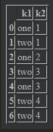

# 数据清洗和准备

> 数据预处理中非常重要的一环就是数据清洗和准备，这里就着重讲一下

## 处理缺失值

> - 在pandas中我们延用R的，将缺失值成为NA，意思是not available，==None对象也被当作NA处理==，使用isnull和notnull来确定缺失值可以返回布尔数组
> - Numpy中有一个nan就是缺失值的意思，我们可以使用这个来生成缺失值

### 过滤缺失值

> ​	可以使用==dropna方法来剔除缺失值==

- 对于一维的数据Series对象,dropna方法会删除na，注意，这里又==生成了一个新对象==。

  ```python
  series=pd.Series(['kirito','asuna',NA,'xilika'])
  series.dropna()
  
  ===
  0    kirito
  1     asuna
  3    xilika
  dtype: object
  ===
  ```

- 对于二维数据DataFrame对象就要用参数了

  ```python
  df=pd.DataFrame([
      [1,2,3],[1,NA,NA],[NA,NA,NA],[NA,6.5,3]
  ])
  
  #直接使用dropna会删除所有包含NA的行
  df.dropna()
  ```

  

  ```python
  #可以传入axis参数，当axis的参数为1时候，会删除所有包含NA的列
  df.dropna(axis=1)	#这里全部删掉了因为每列都有缺失值
  ```

  如果想删除**全是缺失值的行或者列**，就要传入参数how='all'

  ```
  df.dropna(how='all')
  ```

  

- 使用thresh参数设定舍弃每行多少个缺失值被删除

  ```python
  frame.dropna(thresh=2)
  #一行2个缺失值就会被丢弃
  ```

### 填补缺失值

> ​	一般都用fillna来填补缺失值

```python
#全部用0填充
df.fillna(0)

#大部分情况，我们都要对不同的列用不同的方法填充，所以我们可以传入字典，每列用不同的值来填充
df.fillna({0:0,1:1,2:2})	#这里注意，数字不能加引号

#使用inplace参数可以直接替换原来的df，不会生成一个新对象了
df.fillna({0:0,1:1,2:2},inplace=True)

#method参数，一般是ffill，就是从上往下填充，利用上面的值，但是可以设置limit参数，来限制填充的个数
df.fillna(value={0:1},limit=2)
#这里0列用1填充，限制填充个数为2
```

fillna**的一些常用参数**

| 参数    | 描述                                                     |
| ------- | -------------------------------------------------------- |
| value   | 填充的值，可以是==字典==                                 |
| method  | 一般时ffill参数                                          |
| axis    | 默认是0，一般都是列填充嘛，不怎么要管                    |
| inplace | 是否要替换，用了这个为True就不会生成新对象，直接在df上改 |
| limit   | 填充限制的个数                                           |

## 数据转换

### 删除重复值

- 查看有重复的行可以用duplicated()方法来返回要给数组

  ```python
  df=pd.DataFrame({
      'k1':['one','two']*3+['two'],
      'k2':[1,1,2,3,3,4,4]
  })
  df.duplicated()
  ===
  0    False
  1    False
  2    False
  3    False
  4    False
  5    False
  6     True
  ===
  ```

- 使用drop_duplicates()方法可以删除重复行，默认是删除后面的，保留前面的，==注意，这里又返回一个新对象==

  ```
  df.drop_duplicates()
  ```

  

- 有时候我们对某一列重复都要去除，比如ID，所以在去除的时候，可以传入列表就可以,还可以用last参数，来选择是否用最后一个

  ```python
  #这里我想保留最后一个，删除前面重复的
  df.drop_duplicates(['k1','k2'],keep='last')
  ```

  ### 使用函数或映射进行数据转换

  > ​	使用map函数可以对==series==进行操作,或者对DataFrame某一列进行操作，要先选择一列才行

  **可以直接传入函数，也可以指定映射（==这个映射很特殊，要和这一列值一样才可以==），如果省略就是对每个**

  ```python
  df=pd.DataFrame(
      {
          'name':['Kirito','Asuna','Xilika'],
          'age':[16,17,22]
      }
  )
  
  df['age'].map({
      16:'spss',
      17:'sas',
      22:'python'
  })
  
  ===
  0      spss
  1       sas
  2    python
  Name: age, dtype: object
  ===
  #值得注意的是，这里的原来age并没有被更改，这个切片直接生成了一个新对象，不会被改，要重新赋值才可以
  ```

### 替代值

> replace方法提供了用来替代值的方法，但是记住这个会==生成一个新对象==，要用inplace参数来选择

- 对于Series对象，直接用replace(old_value,new_value)就好

  ```python
  data.replace(-999,10)
  #将-999替换成10
  
  #也可以传入字典,下面就是把999替换为-1，1000替换为1
  data.replace({
  	999:-1,
  	1000:1
  })
  ```

### 重命名轴索引

- 索引是一个可迭代的列表对象，所以也可以用map函数进行操作。

  ```python
  data=pd.DataFrame(
      np.arange(12).reshape((3,4)),
      index=['kirito','asuna','sikuha'],
      columns=['age','size','tall','height']
  )
  new_index=data.index.map(lambda x:x.upper())
  data.index=new_index
  #这样就把行索引改为大写的了
  ```

  

- 还有一个更加好的方法，就是rename方法，这个方法允许重新定义index和column,注意==这里又是返回一个新对象，需要改变原来数据的，自行inplace==，

  ```python
  #一般情况下，是不可能改变全部列标签或者索引的，所以一般都是传入字典，把需要改的改一下就好。
  data.rename(
      index={
          'KIRITO':'kirito'
      },
      columns={
          'age':"names"
      }
  )
  ```

### 离散化和分箱

- pd.cut(list,bins)这是分箱的基础方法，第一个参数是==一个列表==，第二个参数是==分箱的方法==，此处也是一个列表，表示区间。

  ```python
  ages=[20,22,25,27,21,23,37,31,61,45,41,32]
  
  #这里分了4箱，19-25，25-35，左开右闭
  bins=[18,25,35,60,100]
  
  #使用分箱会产生要给新对象，然后复值给cats
  cats=pd.cut(ages,bins)
  
  ```

- 分箱后的对象有code属性和categories属性

  ```python
  #code属性是按顺序显示数据的分箱在什么区间，返回一个数据
  cats.codes
  
  ===
  array([0, 0, 0, 1, 0, 0, 2, 1, 3, 2, 2, 1], dtype=int8)
  ===
  
  #categories属性就是显示分割的区间，如果有标签，就会显示标签
  cats.categories
  
  ===
  IntervalIndex([(18, 25], (25, 35], (35, 60], (60, 100]]
                closed='right',
                dtype='interval[int64]')
  ===
  ```

- 可以使用pd.value_counts()来分别计算分箱的个数

  ```python
  pd.value_counts(cats)
  
  ===
  name    5
  come    3
  time    3
  slim    1
  dtype: int64
  ===
  ```

- 还可以使用==分位数，这样bins里面就写4，这样就是4分位数，5就是5分位数，或者你传入一个列表，用0到1之间的数字就可以==。

  ```python
  #这里使用precision是小数点精度
  data=pd.cut(np.random.rand(20),4,precision=3)
  ```

  

### 检测和过滤异常值

- 对一列

```python
#生成一个正态分布的东西
data=pd.DataFrame(np.random.randn(1000,4))

#选出其中一列，然后选出绝对值大于3的值
col=data.loc[:,2]
col[np.abs(col)>3]
```

- 对DataFrame对象，选出大于3或者小于-3的==行==，使用any()，但是要用参数1

```
data[(np.abs(data)>3).any(1)]
```

- 要改变也有点玄学，==使用布尔选择出来得到的东西为False地方是NaN，但是这还是原来的数组，你改变他，原来的还是会改变，只是只改变不是NA的数字。==

  ```
  data[data<-0.5]=np.sign(data)*3
  ```

### 置换和随机抽样

- 要想重新随机排序行的话，可以考虑用numpy的random中的permutation方法。

  ```python
  df=pd.DataFrame(np.arange(20).reshape((5,4)))
  
  #生成一个随机排列的0-4的数组，使用permutation方法
  sampler=np.random.permutation(5)
  
  #使用iloc方法选出来
  df.iloc[sampler,:]
  ```

- 随机抽样使用sample方法就好，但是是否放回就要使用==replace参数，默认为False是不放回的，改为True就是放回的==。

  ```
  #这里有放回
  df.sample(n=3,replace=True)
  
  #这里无放回
  df.sample(n=3)
  ```


### 计算指标/虚拟变量

- 有时候一列我们想把它设为标志，一般都是用来做关联分析的，设置为1，0变量，**这样就可以使用get_dummies方法**

- 这里有个要注意的地方，如果你需要把多个列设置为标志，data必须要是一个DataFrame，所以我们如果切片传入就需要加双[[]]，这样才可以成功

  ```python
  #这个是将df['key']中的东西设置为列，然后前缀用key做,prefix是前缀的意思
  df2=pd.get_dummies(df['key'],prefix='key')
  
  #拼和两张表
  df_with_dummy=df[['data']].join(df2)	
  ```

- 但是大部分情况都是，一般这些东西都是挤在一个单元格中，需要特殊处理

  ```python
  #首先要知道里多少值嘛
  all_genres=[]
  
  for x in df['genres']:
  	all_genres=all_genres+x.split(',')	#假设逗号是分隔符
  
  #使用unique方法去重，得到列表
  genres=pd.unique(all_genres)
  
  #使用zeros构建0矩阵
  zero=np.zeros(len(df),len(genres))	#len用在DataFrame上返回的是行数，实在不理解就len(df.index)
  
  #创建一个DataFrame对象
  tem_data=pd.DataFrame(zero,columns=genres)
  
  #需要把值改成1，就需要用循环了
  for i,gen in df['genres']:
     	tem_data.iloc[i].loc[gen.split(',')]=1
      
  #使用join函数进行加入就好，可以加前缀
  df=df.join(tem_data.add_prefix('Genre_'))
  
  ```

- 与get_dummies相对的东西就是**melt**，这个东西是将列上的东西，放到行上来，按照行上关键词，然后将列堆叠进来，然后value新生成一列，直接上代码，说不是很清楚，有表

  - 

  - ```python
    new=pd.melt(frame=df,id_vars=['class'],value_vars=['nachang','beijing'],var_name='location',value_name='price')
    ```

    - frame：需要进行操作表格
    - id_vars：以什么为标准进行合并，这个就是行，不会变，但是会重复
    - value_vars：把列表的列名，需要放到行的东西放进来
    - var_name：对放到行的列进行命名
    - value_name：并进来会有value，就是行和列决定的，这个会新生成一列，然后对这个列进行命名

  - 

  

## 字符串操作

### 字符串的常用方法

- split和strip，这个个就不多讲了，就是用来处理普通字串的
- replace也没什么好说的
- Index和find函数，这个稍微说一下，index和find都是定位**第一个出现的位置**，但是都细小不同，**find的异常值就会返回-1，所以多用find**。

### 向量化字符串函数

> ​	这里就是重点讲**Series的str属性的使用**

- 字符串在处理时候有缺失值，你想知道他是否有某种字符串，就可以用**str.contains**方法来进行判断

  ```
  data={
      'Dave':'dave@google.com',
      'Steve':'steve@gmail.com',
      'Rob':'rob@gmail.com',
      'Wes':np.NAN
  }
  data=pd.Series(data)
  data.str.contains('gmail')
  ===
  Dave     False
  Rob       True
  Steve     True
  Wes        NaN
  ===
  ```

- 也可以使用re的IGNORECASE防止缺失值干扰

  ```python
  #这里不能用compile对象只能直接传入正则表达式才可以
  data.str.findall(r'([A-Z0-9._%+-]+)@([A-Z0-9.-]+)\.([A-Z]{2,4})',flags=re.IGNORECASE)
  ```

- str属性其实就是返回这个列表，然后里面的对象就是字符串而已，因为map函数是无法对字符串使用的，除非传入字典。

  ```python
  data.str[0:]	#切片
  data.str.upper()	#大写全部
  ```

**对于str的一些方法**：

| 方法        | 描述                                                         |
| ----------- | ------------------------------------------------------------ |
| cat         | 这个方法是按照你想要的分隔符拼接字符串，注意，**要传入一个列表**，而且这个列表的**长度和行数要相等**，就会把相应位置进行拼接 |
| contains    | 查看某个字符串是否在数据中，返回**布尔数组**，可以传入**正则表达式** |
| count       | 模式出现次数的计数，**是对每个元素，出现的次数**             |
| extract     |                                                              |
| findall     | 传入正则表达式的，每个元素地方都会返回列表                   |
| join        | 根据传入的分隔符，将Series整合                               |
| len         | 长度计算                                                     |
| lower,upper | 大小写                                                       |
| match       | 正则的匹配                                                   |
| pad         | 将空白加入到字符串左右两边                                   |
| center      | 等价于pad(side='both')                                       |
| repeat      | 重复值，s.str.repeat(3)，就是把字符串重复三次                |
| replace     | 以其他字符串代替模式或者正则表达式匹配项目，第一个是模式，第二个是要换的值 |
| split       | 拆分                                                         |
| strip       | 去除空白，换行符                                             |
| rstrip      | 去右边                                                       |
| lstrip      | 去左边                                                       |

- **字符串可以直接切片**

  - ```python
    new_file.iloc[:,0].str[:7]	#这里直接切片，对这一列所有的字符串进行切片了
    ```

    