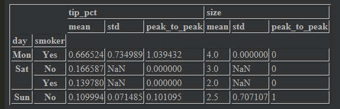
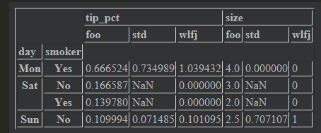

# 数据分组和聚合

> ​	学了数据库就知道，数据分组和聚合非常重要，就是groupby的用法

## GroupBy机制

```python
df=pd.DataFrame(
    {
        'key1':['a','a','b','b','a'],
        'key2':['one','two','one','two','one'],
        'data1':np.random.rand(5),
        'data2':np.random.rand(5)
    }
)
```

这时候想根据key1计算data1列的均值，就可以使用groupby方法

```python
grouped=df['data1'].groupby(df['key1'])		#这样可以生成一个grouped的对象，然后对对象进行操作
grouped.mean()
==
key1
a    0.461396
b    0.513548
Name: data1, dtype: float64
==
```

将多个数组作为列表传入，就会得到一些不同的结果

```python
means=df['data1'].groupby([df['key1'],df['key2']]).mean()	
#注意这里，是分级的，后面groupby是一个独立的东西，只要对齐就好，所以就有下面的例子。
==
key1  key2
a     one     0.598046
      two     0.188096
b     one     0.504296
      two     0.522801
Name: data1, dtype: float64
==
```

甚至还可以拆包

```python
means.unstack('key2')
```


上面也说了，是独立的，所以只要对齐就好

```python
states=np.array(['Ohio','California','California','Ohio','Ohio'])
years=np.array([2005,2005,2006,2005,2006])
grouped=df['data1'].groupby([states,years])
grouped.mean()
====
California  2005    0.188096
            2006    0.504296
Ohio        2005    0.485043
            2006    0.748806
Name: data1, dtype: float64
====
```

### 遍历各个分组

GroupBy对象支持**迭代**，会生成一个包含组名和数据块的2维元组序列。

```python
for name,group in df.groupby(['key1']):
    print(name)
====
a
b
====
	print(group)
====
      data1     data2 key1 key2
0  0.447286  0.649571    a  one
1  0.188096  0.117032    a  two
4  0.748806  0.522643    a  one
      data1     data2 key1 key2
2  0.504296  0.295379    b  one
3  0.522801  0.885934    b  two
====
```

如果有多个分组一起的话，名字就是键的元组

```python
for (k1,k2),group in df.groupby(['key1','key2']):
    print((k1,k2))
====
('a', 'one')	#会自动组合起来的，2*2个可能，就是4个组合
('a', 'two')
('b', 'one')
('b', 'two')
====
	print(group)
===
      data1     data2 key1 key2
0  0.447286  0.649571    a  one
4  0.748806  0.522643    a  one

      data1     data2 key1 key2
1  0.188096  0.117032    a  two

      data1     data2 key1 key2
2  0.504296  0.295379    b  one

      data1     data2 key1 key2
3  0.522801  0.885934    b  two
===
```

如果你想对某一块的数据进行操作，使用dict就好，但是要把groupby对象先变成列表

```python
test=dict(list(df.groupby('key1')))
===
{'a':       data1     data2 key1 key2
 0  0.447286  0.649571    a  one
 1  0.188096  0.117032    a  two
 4  0.748806  0.522643    a  one, 'b':       data1     data2 key1 key2
 2  0.504296  0.295379    b  one
 3  0.522801  0.885934    b  two}
===
test['a']
```


也可以在列上进行分组，只是用的比较少设置axis为1就好

### 选择一列或所有列的子集

可以用语法糖来见你话一些操作

```python
df.groupby('key1')['data1']
#等价于
df['data1'].groupby(['key1'])

df.groupby('key1')[['data1']]
#等价于
df[['data1']].groupby(['key1'])

#这两种东西是不一样的，一个是series对象，一个是DataFrame对象
```

我们来稍微试一下

```python
df.groupby(['key1','key2'])[['data1']].mean()
```


如果用另一个

```python
df.groupby(['key1','key2'])['data1'].mean()
====
key1  key2
a     one     0.598046
      two     0.188096
b     one     0.504296
      two     0.522801
Name: data1, dtype: float64
====
```

**这里就可以知道，如果是数组或者列表就是DataFrame对象，另一个就是Series对象**

### 使用字典和Series分组

> ​	分组信息可能会通过非数组形式，如果按照各列分组，把各列按照组累加

首先得到一个数组。


现在我们把字典传给groupby数组

```python
mapping={
    'a':'red',
    'b':'red',
    'c':'blue',
    'd':'blue',
    'e':'red',
    'f':'orange'
}
by_column=people.groupby(mapping,axis=1)
by_column.sum()	
```


### 使用函数分组

函数分组就是在groupby传入函数，这个函数是对**索引**进行操作的，然后会返回对这个索引处理过后的值，然后就会进行分组。

```python
#people这个函数索引就是名字，按照名字长度来分组
people.groupby(len).sum()
```


### 根据索引层进行分组

我们有分层索引，要想按照分层索引进行索引的话，使用level参数就好

```python
hier_df.groupby(level='country',axis=1).sum()
```


## 数据聚合

聚合函数就是对数组进行操作的函数，sum,mean,count都是具体方法

| 函数       | 描述               |
| ---------- | ------------------ |
| count      | 分组中非NA值数量   |
| sum        | 非NA值累计和       |
| mean       | 非NA平均数         |
| median     | 非NA的算术中位数   |
| std,var    | 标准差，方差       |
| min,max    | 最大，最小         |
| prod       | 非NA的乘积         |
| first,last | 第一个和最后一个值 |

可以自定义聚合函数，但是不推荐的，因为这个东西运行很慢，基本上写好的都够用。

### 逐列及多函数的应用

> ​	可以用agg来传入函数或者方法，只用传入函数名

首先一个表格


```python
#我们先group一下
grouped=df.groupby(['smoker','day'])

#然后我们求均值,可以先选出tip_pct这一列,这个就是切片，单个会返回Series对象
new_group=grouped['tip_pct']
new_group.agg('mean')	#这样就会求均值
====
day  smoker
Mon  Yes       0.666524
Sat  No        0.166587
     Yes       0.139780
Sun  No        0.109994
Name: tip_pct, dtype: float64
====
```

然后可以延申一下，就是对与一列就可以传入多个函数**列表**，注意是**列表**

```python
grouped.agg(['mean','std'])
```


也可以传入自定义函数，但是这个时候就**不能用引号了**

```python
grouped.agg(['mean','std',peak_to_peak])	#这里没有用引号
```



同时也能发现，这个函数的对象是一个数组，一列。

有时候这些方法，想改名字就可以用元组传入

```python
grouped.agg([('foo','mean'),'std',('wlfj',peak_to_peak)])
```



**有时候，我们每列要用不同的函数，不同的操作，这样就可以用传入字典来解决，连切片都省了**

```python
grouped.agg({'tip_pct':['min','max','mean','std'],'size':'sum'})
```


### 返回不含行索引的聚合数据

很多时候我们groupby并不需要索引，可以用**as_index=False**来禁用分组键**作为索引**的行为

```python
df.groupby(['day','smoker'],as_index=False).mean()
```


## 应用：通用拆分——应用——联合

对于Groupyby对象，我们刚才讲了对每列或者某一列进行函数，有时候我们要对分组后的可能要对整个分组的DataFrame进行把握，就需要用apply方法了

```python
df.groupby(['smoker']).apply(top,n=5)
```


**apply函数现在深入了解之后，参数有这些**：

- function:这个就是传入函数，这个函数第一个参数有讲究，对于普通的要是一列或者一行，对于group对象就是一个DataFrame
- axis，这个就是选择对行还是对列操作的，**有时候对于行，对填充有帮助**
- arg,kwgd:这些就是列表参数，或者是字典，这个会被传入function进行操作。

### 压缩分组键

和对象具有分组键作为索引，禁用这个功能就可以用group_keys为False来进行

```
df.groupby(['smoker'],group_keys=False).apply(top)
```

### 分位数与桶分析

以前可以调用pandas的cut方法进行操作对数据进行分组，与groupby方法可以更好进行分组，然后，我们先简单进行一下

```python
frame=pd.DataFrame({
    'data1':np.random.randn(1000),
    'data2':np.random.randn(1000)
})
quartlies=pd.cut(frame['data1'],4)
```

利用cut会产生一个Categorical对象，可以直接传给groupby

```python
grouped=frame.groupby(quartlies).agg(['mean','max'])
```


等宽桶，就是同样样本数进行分桶，就要用qcut，可以用labels=False来获得分位数数值

```python
grouping=pd.qcut(frame.data1,10,labels=False)
grouped.count()
```

### 使用指定分组值来填充缺失值

> 我们经常要分组对东西进行填充，有两种方法，一种就是使用apply，这个也知道是对每个组DataFrame进行操作

```python
#首先有一个有缺失值的Series对象
data
===
Ohio         -0.772707
New York      1.930441
Vermont            NaN
Florida      -0.182806
Oregon        1.292761
Nevada             NaN
California    0.149497
Idaho              NaN
dtype: float64
===

#定义一个函数，在使用在每个组上
fill_mean=lambda x:x.fillna(x.mean())

#分组后使用
data.groupby(group_key).apply(fill_mean)
```

另一种情况，我们可能已经安排好了，某个组要填充什么，已经有要给字典了，这时候有特殊方法

```python
#首先有一个字典
fill_value={'East':0.5,'West':-1}

#然后我们定义一个函数
fill_na=lambda x:x.fillna(fill_value[x.name])	#这里调用组的name属性来从字典获取值

#然后使用apply填充
data.groupby(group_key).apply(fill_na)
```

### 分组加权平均

> ​	这里主要是想讲解一下Numpy的average函数

```
df=pd.DataFrame({
    'category':['a','a','a','a','b','b','b','b'],
    'data':np.random.randn(8),
    'weights':np.random.rand(8)
})

#想分组求均值，这里就可以
get_wavg=lambda x:np.average(x['data'],weights=x['weights'])
df.groupby('category').apply(get_wavg)
====
category
a   -0.700542
b   -0.658206
dtype: float64
```

### 逐组线性回归

```python
import statsmodels.api as sm
def regress(data,yvars,xvars):
    y=data[yvars]
    x=data[xvars]
    x['intercept']=1
    result=sm.OLS(y,x).fit()
    return result.params

by_year.apply(regress,'AAPL',['SPX'])
```