# Pandas学习

**pandas主要是用来处理异质性，表格类数据。而numpy主要是用来处理同质类的数据**

## Series和DataFrame

### Series

> ​	Series是一种==一维的数组类型对象==，它包含了一个值序列并且有==数据标签==，就是索引(==从0开始的==）。

```python
#索引在左边，值在右边，默认索引从0开始
obj=pd.Series([1,2,3,4])

==输出==
0    1
1    2
2    3
3    4
dtype: int64
    

```

```python
#可以使用values，index属性分别获取值和索引
obj.values
obj.index
```

可以自定义索引，就要在使用Series中设置index的参数，用列表来表示

```python
test=pd.Series([1,2,3,4],index=['a','b','c','d'])
test['a']
```

还可以用类似于numpy的索引操作

```python
test[test>2]	#可以选出values大于2的值和索引
```

甚至可以使用numpy的一些操作函数

```
np.exp(test)
np.sum(test)
```

也可以使用字典里面的判断Key是否在里面

```python
'a' in test	#返回True
```

> ​	可以使用字典生成Series

```python
a=['a','b','c']
b=[1,2,3]
dic=dict(zip(a,b))
pd.Series(dic)
```

这里索引的顺序是可以改的

```python
states=['b','a','c']
exl=pd.Series(dic,index=states)

#还可以这样
exl.index=['a','b','c']
```

==pandas中的缺失值就是NaN==，也可以使用isnull和notnull来检查是否有缺失值

```python
a=['a','b','c']
b=[1,2,3]
dic=dict(zip(a,b))
state=['a','b','c','d']	#这里多了一个d，就会有缺失值
exl=pd.Series(dic,index=state)

=======
a    1.0
b    2.0
c    3.0
d    NaN
=======

#使用isnull来输出,如果为null位置就是True
pd.isnull(exl)
#也可以用实例方法exl.isnull()
====
a    False
b    False
c    False
d     True
====


```

Series的索引和本身有name的属性

```python
exl.name='population'
exl.index.name='state'
print(exl)

===
state
a    1.0
b    2.0
c    3.0
d    NaN
Name: population, dtype: float64
===
```

### DataFrame

> ​	这个就是二维数据的处理方法

```python
data={
    'state':['kirito','xilika','asuna'],
    'year':['2000','2001','2002'],
    'pop':[1.5,1.6,1.7]
}
exl=pd.DataFrame(data)	#这个输出会自带索引，就是每行的行号，才是索引
```

> ​	==对于大型表格，使用head()方法，就可以只选取头部5行==

```python
frame.head()
```

要想指定列顺序，在创建表的时候就要主义，columes参数

```python
exl=pd.DataFrame(data=data,columns=['year','state','pop'])
```

要想选取其中一列，就要使用frame.列名称

```python
exl.year

===
0    2000
1    2001
2    2002
Name: year, dtype: object
===
```

- ==如果传入columns中的列表中含有不存在字典中的列==那那一列会全是缺失值。==记住，只有在columns中才会，如果在字典中，不匹配长度，会直接报错==。
- **还可以设置Index索引**

```python
exl=pd.DataFrame(data=data,columns=['year','state','pop','target'],index=['one','two','three'])	#这样就产生了空列
```

==可以对列进行修改的==

```python
exl.target=16.6 	#这样那一列空值就会变成16.6
```

- ==可以用np的数组，或者列表，或者Serise对象对列进行赋值，但是最好要对应，如果Series不是一一对应的话，就会按照索引来进行匹配了==
- **如果列不存在，就会生成一个新的列**

```python
exl.target=np.arange(3)
exl.target=pd.Series([1,2,3],index=['two','three','one'])
```

使用==del==的方法，可以删除列，但是记住不能用.，只能用[],这类

```python
del exl['year']
```

> ​	当使用字典嵌套的时候，最外层的键会是列，里面的键就会是索引

```python
data={
    'kirito':{
        '2000':2.4,
        '2001':1.2
    },
    'asuna':{
        '2001':2.8,
        '2004':2.6
    }
}
exl=pd.DataFrame(data)	#会有空值，因为索引不一样
```

==类似numpy==，可以使用，arr.T这种方法来转置。

```python
exl.T
```

values属性，会返回一个数组对象

```python
exl.values

===
array([[ nan,  2.4],
       [ 2.8,  1.2],
       [ 2.6,  nan]])
===
```

**DataFrame构造函数的有效输入**

### 索引对象

> ​	索引对象是==不可变的，但是只是说不能用列表的方式改比如index[1]='b',但是利用索引方式可以改，obj.index=new_index,这个New_index就是一个索引对象==

```python
obj=pd.Series(range(3),index=['a','b','c'])
index=obj.index
```

索引是可以切片的，只是不能改

```python
index[1:]
```

索引对象可以提取出来，赋值给一个变量，==这里是复制了==，就可以进行一些操作

```python
obj_index=obj.index
new_index=pd.Index(['c','d','e'])

#利用append方法，将新索引加进去生成一个新索引对象，但是这个新的索引对象并不是原来的，原来的还在
new_index=obj_index.append(new_index)
```

**一些常用的索引操作方法：**

| 方法         | 描述                                                 |
| ------------ | ---------------------------------------------------- |
| append       | 将两个**索引对象**连接起来，生成一个**新的索引对象** |
| difference   | 计算两个索引的**差集**                               |
| intersection | 计算两个索引的**交集**                               |
| union        | 计算**并集**                                         |
| isin         | 计算每一个值是否在传值容器中                         |
| delete       | 将位置为i的元素删除，生成**新的索引**                |
| drop         | 根据传参删除指定索引，并且产生**新的索引**           |
| insert       | 在位置为i插入元素，产生新索引                        |
| unique       | 计算索引的唯一值序列                                 |

## 基本功能

### 重建索引

> ​	reindex是用于创建一个符合新索引的**新对象**，这里注意是==新对象，旧的对象是不变的，要赋值给新的==，使用reindex方法，会按照新的索引序列进行排序，**如果有个索引值之前不存在，就会有缺失值**

```python
obj=pd.Series([4,5,6,7],index=['d','a','b','c'])

#要创建新的对象才可以，所以要赋值
new_obj=obj.reindex(['a','b','c','d','e'])
new_obj

=====
a    5.0
b    6.0
c    7.0
d    4.0
e    NaN
dtype: float64
====

#旧对象是不变的
obj

====
d    4
a    5
b    6
c    7
dtype: int64
=====
```

> ​	reindex不但可以对Series操作，也可以对DataFrame进行操作，改变行和列。

```python
frame=pd.DataFrame(np.arange(9).reshape((3,3)),index=['a','b','c'],columns=['time','copy','paste'])
frame2=frame.reindex(index=['b','a','c'],columns=['copy','paste','delete'])

#这样就会生成一个新的对象，索引和列都不一样

```

**reindex方法的参数**：

| 参数       | 描述                                                         |
| ---------- | ------------------------------------------------------------ |
| index      | 行索引的改变用这个                                           |
| method     | 插入方式，'ffill'为向前填充，而'bfill'是向后填充             |
| fill_value | 通过重新索引引入缺失数据时使用的替代值                       |
| limit      | 向前或向后填充时候，所需要填充的最大尺寸间隙                 |
| copy       | 如果为True，即使新索引等于旧索引，也总是赋值底层数据，如果是False就索引相同时不要复制数据 |

### 轴上删除条目

> ​	drop是用来删除数据的，利用索引进行删除，如果直接用drop，==不设置inplace参数==，会生成一个新对象，进行修改。如果想直接修改原数据，用将inplace设置为True

```python
obj=pd.Series(np.arange(5),index=['a','b','c','d','e'])
#这里复制一个新对象，旧的对象没有变
new_obj=obj.drop('a')

#如果需要更改元数据，直接
obj.drop('a',inplace=True)
```

### 索引、选择和过滤

> Series的利用数字的普通切片，**类似于python的切片，但是如果使用索引会有所不同，会包括最后一项。**

```python
obj=pd.Series(np.arange(4),index=['a','b','c','d'])
#这种就是不包括最后一项
obj[0:2]
=====
a    0
b    1
dtype: int32
====

#但是索引不一样
#这个是提取出索引为b的
obj['b']

#还有就是传入列表
obj[['a','c','d']]

====
a    0
c    2
d    3
dtype: int32
====

#还有就是这个了，尤其注意，切片操作不能传入列表，不能obj[['a':'b']]
obj['a':'d']

====
a    0
b    1
c    2
d    3
dtype: int32
====
```

> 对于DataFrame对象，需要有选择行和列

- 单独选择行

  ```python
  #这里选择行不能像Series使用索引，值可以使用切片
  data=pd.DataFrame(np.arange(16).reshape((4,4)),
                  index=['a','b','c','d'],
                    columns=['kirito','asuna','alice','kelaiyin'])
  
  #选取一到三行
  data[:3]
  ```
  
- 对列进行取出

  ```python
  #列的取出就比较简单了，就是传入列表，来选择
  data[['kirito','asuna']]
  ```

- 还可以用布尔进行切片

  ```python
  #这里比如我们要取出kirito列中大于大于5的行
  data[data['kirito']>5]
  ```

#### 使用Loc和loic选择数据

> ​	在DataFrame上操作没有进行索引的操作，也没有进行行和列的同时选择，使用loc和iloc进行操作

- loc

  - loc是用来选择索引的，可以做类似于Numpy的切片

    ```python
    #这个和numpy非常像，第一个就是从0轴也就是行上进行选择，第二个就是在1轴上就是在列上进行操作
    data.loc['a':'d','kirito':'kelaiyin']
    ```

    

- iloc

  - iloc和loc不一样的地方就是iloc是负责选择数字的，就是只能多少行，多少列，和numpy一模一样

    ```python
    data.iloc[0:3,2:]
    ```

### 算术和数据对齐

> ​	对于pandas数据的相加，如果索引不相等进行相加，就会把这个新的索引加进去，而且会返回NaN的，也就是说只有都有的行索引和列索引才能相加，只要一方没有，就会多加一行，或者多加一列，里面全是NaN。

```python
df1=pd.DataFrame(np.arange(9).reshape((3,3)),columns=list('bcd'),index=['kirito','asuna','alice'])
df2=pd.DataFrame(np.arange(12).reshape((4,3)),columns=list('bde'),index=['kirito','asuna','alice','kelaiyin'])

#这里如果相加
df3=df1+df2

df3
=====

```

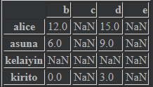

#### 使用填充值的算术方法

> ​	因为有时候真的很想把另一个表格中的属性和一些东西加到一个新的中，生成一个新的表格，或者进行填充值。

- 添加属性，加法

  - 这里不可以直接加，需要用add函数

    ```
    df4=df1.add(df2,fill_value=0)
    ```

    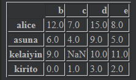

一些常用的对DataFrame的一些算术方法

| 方法               | 描述 |
| ------------------ | ---- |
| add,radd           | 加法 |
| sub,rsub           | 减法 |
| div,rdiv           | 除法 |
| floordiv,rfloordiv | 整除 |
| mul,rmul           | 乘法 |
| pow,rpow           | 幂次 |

==这些r就是翻转，比如说，除以会变成除==

#### DataFrame和Series间的操作

> ​	上次我们讲的DataFrame之间的操作是二维和二维操作，直接加，都会索引对应，然后一方没有就会用缺失值，但是DataFrame和Series因为是不同维度上的操作，会有==广播机制==

- 所谓广播机制，如果我们将Series和DataFrame对象之间进行加减，就会对==**每行进行同样的操作**==，**当然列的索引要对应，如果不对应就会产生NaN报错**

  ```python
  frame=pd.DataFrame(
      np.arange(12).reshape((4,3)),
      columns=list('bde'),
      index=['Utah','Ohio','Texas','Oregon']
  )
  series=frame.iloc[0]
  ```

  接下来我们看一下frame，series

  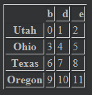

```python
b    0
d    1
e    2
Name: Utah, dtype: int32
```

```python
frame-series
```

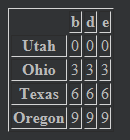

> ​	这里就可以看到，每一行都进行了广播操作。

如果有一列不在的情况下，就会出现缺失值加减，类似于二维的那个

```python
series2=pd.Series(range(3),index=list('bef'))
frame+series2
```

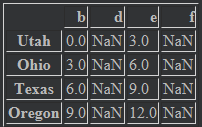

> ​	有时候要在列上进行广播，行上进行匹配，那就必须用算术方法的一种了，就是前面那个表格

```python
series3=frame['d']
frame.sub(series3,axis=0)	#这个就是选择行上进行对齐，然后相除
```

### 函数应用和映射

> ​	np的通用函数对pandas有用，本质上都是数组

```python
np.abs(frame)
```

> ​	也可以使用==**apply方法**==，可以对一行或者一列进行绑定函数

```python
frame=pd.DataFrame(np.random.randn(4,3),columns=list('bde'),index=['kirito','asuna','sikuha','sinon'])
f=lambda x:x.max()-x.min()

#这里默认是对列进行操作，如果想对行进行操作，axis=1才可以
frame.apply(f)


====
b    2.674635
d    1.462998
e    1.871640
====
```

```python
#传递给apply函数并不一定要传回一个标量，可以传回一个series
def f(x):
    return pd.Series([x.max(),x.min()],index=['max','min'])
frame.apply(f)
#会输出一个矩阵
```

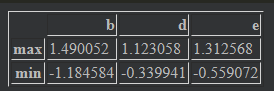

ps:**applymap函数可以对每一个元素进行操作哦**

### 排序和排名

> ​	首先要明确的是，排序永远会生成要给==新对象==

- 按照行索引或者列索引进行排序，使用sort_index()函数，axis可以考虑是对行还是对列索引进行排序，0时候是对行，1是对列

  ```python
  frame=pd.DataFrame(np.arange(8).reshape((2,4)),index=['three','one'],columns=list('dabc'))
  frame.sort_index(axis=1)
  ```

  

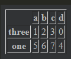

这里对列进行排序了，成了a,b,c,d顺序，还可以调整是升序还是降序，使用ascending参数，这个是升序的意思

```python
frame.sort_index(axis=1,ascending=False)
```

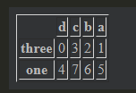

- Series如果要进行排序需要使用sort_values()方法,同样有==ascending==方法，默认情况下，缺失值会放在==尾部==

  ```python
  #升序的参数可选
  series.sort_values(ascending=False)
  ```

- DataFrame对象如果要排序，就要使用==by参数来指定按照某一列进行排序，而且还可以传入列表，先后顺序==

  ```python
  frame=pd.DataFrame({'b':[4,7,-3,2],'a':['0','1','0','1']})
  frame.sort_values(by=['b','a'],ascending=False)
  ```

  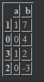

- ranke()方法是返回这个数字在某一个维度上的排名的方法

  ```python
  frame.rank()
  ```

  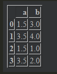

  ```python
  #默认的排名方法是average，所以就会出现相同数值时候有0.5这种排名,如果想要取消这种，可以使用一些方法
  frame.rank(method='max')	#这里使用最大的进行排名，就会可以到4排名
  ```

  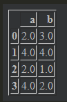

  ```python
  #还可以用min方法
  frame.rank(method='min')
  ```

  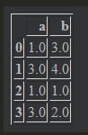

==**如果出现索引相同的情况下，是会返回列表的，使用is_unique属性，可以查看是否索引独特**==

```
series=pd.Series(np.arange(3),index=['a','a','b'])
series['a']
```

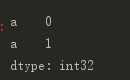

```python
series.index.is_unique	#会返回一个布尔值
```

***

## 描述性统计的概述和计算

一般的函数操作，都是对列上进行操作,如果要对行进行操作，记得使用axis=1

```python
df=pd.DataFrame([[1.4,np.nan],[7.1,-4.5],[np.nan,np.nan],[0.75,-1.3]],index=['a','b','c','d'],columns=[0,1])
df.sum(axis=0)

===
0    9.25
1   -5.80
dtype: float64
===

#这里默认跳过了缺失值，不然不可能这样
df.sum(skipna=False)
===
0   NaN
1   NaN
dtype: float64
====
```

==一些常用的描述性统计方法（都是对每列的）==：

| 方法          | 描述                               |
| ------------- | ---------------------------------- |
| count         | 计算非NaN的个数                    |
| describe      | 计算每列的汇总统计集合             |
| min,max       | 最大值，最小值                     |
| idxmin,idxmax | 最小值，最大值的索引标签           |
| quantile      | 计算样本从0到1之间的分位数         |
| sum           | 求和                               |
| mean          | 均值                               |
| median        | 中位数                             |
| mad           | 平均值的平均绝对偏差               |
| prod          | 所有值的积                         |
| var           | 方差                               |
| std           | 标准差                             |
| skew          | 样本偏度（第三时刻）值             |
| kurt          | 样本峰度（第四时刻）值             |
| cumsum        | 累计值                             |
| cummin,cummax | 累计值的最小值和最大值             |
| cumprod       | 值的累计积                         |
| diff          | 计算第一个算术差值（时间序列东西） |
| pct-change    | 计算百分比                         |

### 相关性和协方差

> ​	相关系数和协方差都是重要的计算，所以要单独提出来说

```python
#这里要先假设一个DataFrame为df，列分别为IBM,Huawei,Google,Yahoo
#我们要计算Yahoo和Google的协方差和相关系数

#相关系数
df['IBM'].corr(df['Google'])

#协方差
df['IBM'].cov(df['Google'])

#假如我想要返回所有列和IBM的相关系数
df.corrwith(df['IBM'])

#还可以输出协方差矩阵和相关系数矩阵
df.cov()
df.corr()
```

### 唯一值、计数和成员属性

> ​	有时候需要知道唯一值，所以可能会用到==unique==函数，可以返回==一个数组==，注意==只能对一维数据使用==，==如果要对二维数据使用==一定要先选择一行或者一列

```python
df[0].unique()
===
array([ 1.4 ,  7.1 ,   nan,  0.75])
===
```

使用==value_counts()==方法可以对一维数据的值进行计数统计

```python
series=pd.Series(np.arange(10))
series.value_counts()
===
9    1
8    1
7    1
6    1
5    1
4    1
3    1
2    1
1    1
0    1
===
#这里的意思是9出现1次，8出现1次
```

> ​	==isin==方法是对每个值判断是在这个列表中，返回要给布尔数组

```python
series.isin([1,2])

===
0    False
1     True
2     True
3    False
4    False
5    False
6    False
7    False
8    False
9    False
dtype: bool
===
```

