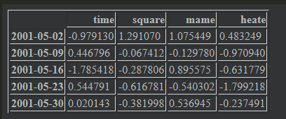
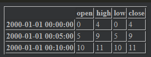
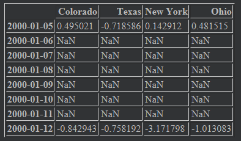
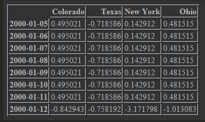
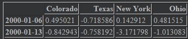
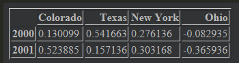
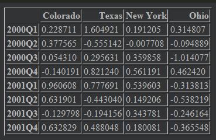
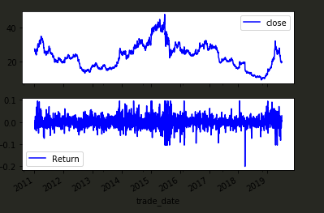

# 时间序列

> ​	时间序列分析是很重要的一种分析，python中主要是用datetime.datetime来处理时间，具体的看基础里面有

## 日期和时间的类型和处理工具

datetime是经常用在时间序列分析里面的所以我们重点讲一下

```python
from datetime import datetime
now=datetime.now()	#这个就是获取当前时间，返回一个datetime对象
now.year,now.mouth,now.day	#这个可以分别返回年，月，日
```

datetime还可以用来求差值和细化时间

```python
delta=datetime(2011,1,7)-datetime(2008,6,24,8,15)	#会返回要给差值，有两个属性，一个是days，一个是seconds

#可以调用这两个属性，获得数值
delta.days
delta.seconds	
```

可以用datetime对象加上和减去delta对象的

### 字符串与datetime互相转换

> ​	我们通常的数都是字符串格式的，有时候需要改成datetime格式就要使用方法了

- 可以用**strftime或者str**方法来对datetime对象和Pandas的Timestamp对象进行格式化

```python
stamp=datetime(2011,11,3)

str(stamp)
====
'2011-11-03 00:00:00'
===

stamp.strftime('%Y-%m-%d')
===
'2011-11-03'
===
```

- 可以用**srtptime**来将字符串变成datetime对象

```python
value='2011-01-03'
date=datetime.strptime(value,'%Y-%m-%d')
```

- datetime的格式说明

| 类型 | 描述                            |
| ---- | ------------------------------- |
| %Y   | 这个是*四位数*的年              |
| %y   | 这个是两位数的年份              |
| %m   | 两位数的月份                    |
| %d   | 日期                            |
| %H   | 小时**24小时**制                |
| %I   | 小时，**12小时**制              |
| %M   | 两位数的分钟                    |
| %S   | 秒                              |
| %w   | 星期日期                        |
| %U   | 一年中星期数                    |
| %z   | 格式为+HHMM或-HHMM的UTC时区偏移 |
| %F   | %Y-%m-%d的简写                  |
| %D   | %m/%d/%y的简写                  |

- 更便捷的方法是**dateutil包的parser.parse方法**，非常方便

```python
from dateutil.parser import parse

#可以自动解析各种格式
parse('20110103')
parse('2011-01-03')
parse('2011/01/03')

#有时候在国际场合下，日期出现在月份前面也很常见，可以使用dayfirst=True来表明这种情况
parse('6/12/2011',dayfirst=True)
```

- pandas是面向数组的，可以自带解析方法，**to_datetime()**方法转换为标准日期格式

```python
#非常方便就可以把一列的字符串格式日期转化为datetime格式
df1['trade_date']=pd.to_datetime(df1['trade_date'])
df1.head()
```

## 时间序列基础

- 当datetime对象被作为索引时候，索引自动变成DatetimeIndex索引

```python
ts=pd.Series(np.random.rand(10),index=dates)	#这里dates是一个datetime对象的数组
ts.index

===
DatetimeIndex(['2019-06-28', '2019-06-27', '2019-06-26', '2019-06-25',
               '2019-06-24', '2019-06-21', '2019-06-20', '2019-06-19',
               '2019-06-18', '2019-06-17'],
              dtype='datetime64[ns]', name='trade_date', freq=None)
===
```

- DatetimeIndex中的标量值是pandas中的Timestamp对象

```
ts.index[0]

====
Timestamp('2019-06-28 00:00:00')
====
```

### 索引、选择、子集

> ​	当使用DatetimeIndex对象作为行索引的时候有很多简便的方式进行选择

- 直接使用可以解释为date的字符串进行选择

```
ts['20190628']	#直接选择出来
```

- 可以选择某一年份，某一月份，甚至时间段来进行切片，如果是DateFrame格式，记得用Loc选择，**值得注意的是，这里的切片类似于numpy不会生成一个新对象**

```python
#当为series对象时候
ts['2011']
ts['2011-07']
ts['2011-01-02':'2011-02-03']

#对象是DateFrame时候
dates=pd.date_range('2000-01-01',periods=100,freq='W-WED')
long_df=pd.DataFrame(np.random.randn(100,4),index=dates,columns=['time','square','mame','heate'])

long_df.loc['2001-05']
```



### 含有重复索引的时间序列

> ​	这个一般不不会发生，但是也可能发生

有重复没关系，如果想删除建议用去重，也可以分组处理

```
dates=pd.DatetimeIndex(['1/1/2000','1/1/2000','1/1/2011'])
dup_ts=pd.Series(np.arange(3),index=dates)
dup_ts.groupby(dup_ts.index).mean()

===
2000-01-01    0.5
2011-01-01    2.0
dtype: float64
====
```

## 日期范围、频率和移位

有时候需要对频率产生相应规定，比如我们每隔15分钟刷新，一次，也就是每隔15分钟要有一个值，没有的话要产生缺失值才对所以可以使用**resample**方法将样本时间序列转换为固定时间序列

```python
A=dup_ts.resample('D')
```

### 生成日期范围

- 使用**pandas.date_range**可以根据特定频率生成指定长度的DatetimeIndex

```python
index=pd.date_range('2012-04-01','2012-06-01')	#这里会包括end结尾的日期，且默认按照每天生成
```

* 如果想生成多久时间，如果生成20天，30天，这种可以使用periods参数

```python
#这里我们生成10天
pd.date_range(start='2012-1-1',periods=10)
```

* 有freq参数，可以设置刷新频率

| 别名              | 偏置类型            | 描述                           |
| ----------------- | ------------------- | ------------------------------ |
| D                 | Day                 | 日历中每天                     |
| B                 | BussinessDay        | 工作日的每天                   |
| H                 | Hour                | 小时                           |
| T或min            | Minute              | 分钟                           |
| S                 | Sencond             | 秒                             |
| M                 | MonthEnd            | 日历日的月底日期               |
| BM                | BussinessMouthEnd   | 工作日月底日期                 |
| MS                | MonthBegin          | 日历月初日期                   |
| BMS               | BussinessMouthBegin | 工作月初的日期                 |
| W-MON,W-TUE       | Week                | 按照特定的星期日期按照每周取出 |
| WOM-1MON,WOM-2MON | WeekOfMonth         | 在本月                         |

- 可以标准化为零点时间轴

```python
pd.date_range('2012-05-02 12:56:31',periods=5,normalize=True)
```

### 频率和日期偏置

> Pandas中的频率是由基础频率和倍数组成的。基础频率通常会有字符别名，例如'M'，'H'这类东西，不过这种东西一般不用显示创建，一般都是可以用一些方法进行生成

- 我想间隔频率为4倍的h，就可以

```pyhon
pd.date_range('2000-01-01','2000-01-03',freq='4h')
```

- 还可以间隔1小时30分，直接freq='1h30min
- 月中的某个星期，'WOM-3FRI',这个就是一个月中第三个星期的星期五

### 位移（向前和向后）日期

有时候日期是需要向后或者向前移动，而不用特地改变索引，使用shift函数

```python
ts=pd.Series(np.random.randn(4),index=pd.date_range('1/1/2000',periods=4,freq='M'))
ts	#输出看一下

====
2000-01-31   -1.001346
2000-02-29    0.290932
2000-03-31   -0.354601
2000-04-30    1.061837
Freq: M, dtype: float64
====

ts.shift(2)	#这这里将日期向上移动，我们看看,负数就是向下，会引入缺失值，而且会丢弃数据
===
2000-01-31         NaN
2000-02-29         NaN
2000-03-31   -1.001346
2000-04-30    0.290932
Freq: M, dtype: float64
===
```

但是有时候，我们真的知道了，要怎么移动，比如对应不对，要后移连个月才是我们对应的数值，可以使用参数freq

```python
ts.shift(2,freq='M')
===
2000-03-31   -1.001346
2000-04-30    0.290932
2000-05-31   -0.354601
2000-06-30    1.061837
Freq: M, dtype: float64
===

#这里就不是单纯向下移动了，而是直接改了索引，后移两个月
```

#### 使用偏置进行位移日期

- pandas日期偏置也可以使用datetime或Timestamp对象完成

```python
from pandas.tseries.offsets import Day,MonthEnd
now=datetime(2019,7,4)
now+3*Day()
```

这里一定要用pandas里面的偏移量来进行操作

- 可以使用rollforward和rollbak分别显示将日期进行滚动

```python
offset=MonthEnd()
offset.rollforward(now)	#移动到本月月底
offset.rollback()	#移动到上个月月底
```

- 结合groupby方法可以进行分组，非常厉害

```python
ts.groupby(offset.rollforward).mean()
```

可以用resample更加方便

## 时间区间和区间计算

> 时间区间表示的是时间范围，比如一些天、一些月、一些季度或者一些年。Period类表示的就是这种数据类型，需要一个字符串或者数字表示频

- 这里我们重点讲一下Period的用法

  - Period表示的是一个时间段，第一个参数是其实时间，第二个是频率，代表的区间就是第一个时间点加上按照频率格式化的时间

    - ```
      p=pd.Period('2007-7-1',freq='M')	#这个意思就是2007-7月这个月的时间
      #可以进行加减，会按照频率加减
      p-1
      ===
      Period('2007-06', 'M')
      ===
      ```

      

- 可以使用period_range来创建规则的时间序列

  ```python
  rng=pd.period_range('2000-1-1','2000-6-30',freq='M')	#这会创建要给PeriodIndex对象
  rng
  ===
  PeriodIndex(['2000-01', '2000-02', '2000-03', '2000-04', '2000-05', '2000-06'], dtype='period[M]', freq='M')
  ===
  
  #这个可以作为索引使用的
  ```

### 区间频率转换

使用asfreq可以转化区间，但是这里有点子复杂，顺序就是首先按照原来的日期，来判断所属时间，然后再转换，不好抄下来，直接看书吧

## 重新采样和频率转换

> 重新采样就是将时间序列从一个频率转换为另一个时间频率的过程，但是有很多用处，可以按照频率进行分组等等操作

- pandas对象都有resample只不过就是在时间序列上用途较大，里面内置groupby的API可以很方便进行分组，然后调用聚合函数或者agg

```python
rng=pd.date_range(start='2000-01-01',periods=100,freq='D')
ts=pd.Series(np.random.randn(len(rng)),index=rng)
ts.resample(rule='M').mean()

===
2000-01-31    0.019228
2000-02-29    0.057893
2000-03-31   -0.259198
2000-04-30   -0.136557
Freq: M, dtype: float64
====

ts.resample('M',kind='period').mean()
===
2000-01    0.019228
2000-02    0.057893
2000-03   -0.259198
2000-04   -0.136557
Freq: M, dtype: float64
===
```

- resample非常适合用来处理大型时间序列问题，一些参数可以设置

| 参数        | 描述                                                         |
| ----------- | ------------------------------------------------------------ |
| freq        | 这个不多说，就是采样频率的                                   |
| axis        | 轴向，默认是0，一般都是0                                     |
| fill_method | 向上采样方式，默认不差值                                     |
| closed      | 向下采样中，每段间隔，哪一段是包含的，比如选择'right'或者'left' |
| label       | 向下采用中，如何用”right"或“left"的箱标签标记聚合结果，*这个在例子中介绍* |
| loffset     | 对箱标签进行时间调校                                         |
| limit       | 向前或向后填充时候，填充区间的最大值                         |
| kind        | 对于区间"period"或者时间戳”timestamp“的聚合，默认为时间序列索引的类型 |
| convention  | 对区间重新采样时候，用于将低频周期转换为高频的约定，默认为”end" |

### 向下采样

将数据聚合到一个规则的低频率上是一个常见的时间序列任务。你要聚合的数据不必是固定频率的。期望的频率定义了用于对时间序列切片以聚合的箱体边界。使用resample进行向下采样数据时有些事情需要考虑

- 每段间隔的哪一边是闭合的
- 如何在间隔的起始或结束位置标记每个已聚合的箱体

我们举个例子

**这里重点提一下**所有看的时候，都是看从这个点到下一个点的聚合

```python
rng=pd.date_range('2000-01-01',periods=12,freq='min')
ts=pd.Series(np.arange(12),index=rng)
ts

===
2000-01-01 00:00:00     0
2000-01-01 00:01:00     1
2000-01-01 00:02:00     2
2000-01-01 00:03:00     3
2000-01-01 00:04:00     4
2000-01-01 00:05:00     5
2000-01-01 00:06:00     6
2000-01-01 00:07:00     7
2000-01-01 00:08:00     8
2000-01-01 00:09:00     9
2000-01-01 00:10:00    10
2000-01-01 00:11:00    11
Freq: T, dtype: int32
===

#我们用每5分钟频率做一个聚合函数,并且采用右边闭合（默认是左边闭合）
ts.resample(rule='5min',closed='right').sum()

===
1999-12-31 23:55:00     0
2000-01-01 00:00:00    15	#我解释一下这里意思，这里是指00：00：00到00：05：00的的左开右闭区间
2000-01-01 00:05:00    40
2000-01-01 00:10:00    11
Freq: 5T, dtype: int32
===

ts.resample(rule='5min',closed='left').sum()
===
2000-01-01 00:00:00    10	#这里是左闭合，然后到00：05：00的聚合，右边不包括
2000-01-01 00:05:00    35
2000-01-01 00:10:00    21
Freq: 5T, dtype: int32
===
```

对于label参数，只会改变时间，最后可以调整一下时间，比如一秒钟，可以用loffset来进行操作

```python
ts.resample(rule='5min',closed='right',label="right",loffset='1s').sum()
===
2000-01-01 00:00:01     0
2000-01-01 00:05:01    15
2000-01-01 00:10:01    40
2000-01-01 00:15:01    11
Freq: 5T, dtype: int32
===
```

### 开端-峰值-谷值-结束（OHLC)重新采样

我们常常需要了解分位数桶中的这些数值，可以直接使用ohlc()方法进行

```python
ts.resample("5min").ohlc()
```



### 向上采样与插值

当从低频率为高频率时，并不需要任何聚合。让我们考虑带有每周数据的DataFrame

```python
frame=pd.DataFrame(np.random.randn(2,4),
                   index=pd.date_range('1/1/2000',periods=2,freq="W-WED"),
                   columns=['Colorado','Texas','New York','Ohio'])
df_daily=frame.resample('D').asfreq()	#这里一定要用asfreq()方法，不然只会生成一个对象，类似与groupby一样
df_daily
```



可以使用fillna和reindex进行填充或者插值方法用于重采样

```python
frame.resample("D").ffill()	#填充
```



也可以限制填充数量是Limit参数是限制

```python
frame.resample('W-THU').ffill()	#这又是一个例子，可以从日又变为两行，但是不一样
```



### 使用区间进行重新采样

对以区间为索引的数据进行采样与时间戳的情况类似

```python
frame=pd.DataFrame(np.random.randn(24,4),
                   index=pd.period_range('2000-01','2001-12',freq="M"),
                   columns=['Colorado','Texas','New York','Ohio'])
annual_frame=frame.resample('A-DEC').mean()
```



这里我们值得注意的是pyton的按照季度汇总和抽样

```python
frame.resample('Q-DEC').mean()	#这里Q-DEC的意思是以12月月末为季度结尾，就是正常的季度意思，其他意思看书
```



## 金融时间序列分析的一些常用

### 计算收益率的对数值

**注意一定要用向量方法，不然会很卡，不要用迭代**

```python
df['Return']=np.log(df['close']/df['close'].shift(1))	#这里利用移动时间轴来进行操作就可以获得向量
df['Return']
```

可以作图试一下，**这里要注意**

```python
df[['close','Return']].plot(subplots=True,style='b')	#这里subplots一定要写True,这样才可以创建子图，不然永远绘图在一个坐标轴里面，非常难看，坐标轴统一
```



