# 绘图和可视化

> ​	数据直观和可视化离不开的，这节就会粗略的介绍一下python的画图问题
>
> ==**值得注意的是，每次换个cell表就会被重置，所以需要在同一个cell写表，包括子图**==

## 简单matplotlib入门

```python
#一般都是使用matplotlib下面的pyplot包进行可视化
import matplotlib.pyplot as plt
#如果想随时查看的话，还需要用%matplotlib inline来显示
```

### 图片和子图

- 一般情况下，我们只用使用一个画布画一张图就可以使用plt.subplot()来创建画布对象

  ```python
  fig=plt.subplot()
  ```

- 但是如果我们需要一张画布画多图的时候，我们就要用plt.subplots(x,y)这个复数形式了，x和y分别为行数和列数。**==这个会返回一个元组的，第一个是画布对象，第二个是表的对象==**

  ```python
  fig，axes=plt.subplots(2,3)	#这里操作还要对后面的axes切片，用表的对象进行切片
  ```

  对于这种，我们可以使用切片来选择我们想要的图

  ```python
  axes[1,1]	#这个就选择了第二行，第二列的表
  ```

- subplots有下面方法

  | 参数   | 描述                      |
  | ------ | ------------------------- |
  | nrows  | 行数                      |
  | ncols  | 列数                      |
  | sharex | 所有子图使用相同的x轴刻度 |
  | sharey | 所有子图使用相同的y刻度   |

#### 调整子图周围的间距

> 使用plt.subplots_adjust方法可以调整子图之间的间距，其实这个应该就是对画布进行操作的方法

```python
fig,axes=plt.subplots(2,2,sharex=True,sharey=True)
for i in range(2):
    for j in range(2):
        axes[i,j].hist(np.random.randn(500),bins=50,color='k',alpha=0.5)
plt.subplots_adjust(wspace=0,hspace=0)
#最后这个plt.subplots_adjust有两种实现方法，可以对fig对象使用这个方法，因为fig就是画布对象
fig.subplots_adjust(wspace=0,hspace=0)
```

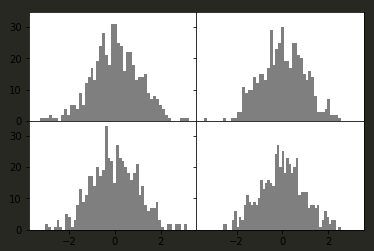

### 颜色、标记和线类型

> ​	如果不创建子图，**可以直接用子函数plot函数来接收x和y轴的数组**以及一些可选的字符串缩写参数来指明颜色和类型。

```python
plt.plot(np.random.randn(30).cumsum(),'ko--')
#这段代码是生成折线图的，使用标记的黑色，用虚线
```

> ​	可以显示代码，好理解些

```python
plt.plot(np.random.randn(30).cumsum(),color='k',marker='o',linestyle='dashed')
```

对于折线图，你会注意到线是内插的，可以通过drawstyle进行更改

```python
plt.plot(data,'k--',label='first')
plt.plot(data,'k-',drawstyle='steps-post',label='steps-post')
plt.legend(loc='best')	#这里一定要用legend方法来生成左上角的图例
```

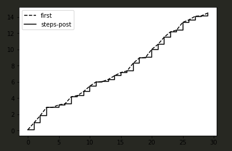

无论是是否是有label，想要有图例，必须要传入legend的loc='best'

### 刻度、标签和图例

> 在一些时候，我们肯定需要设置**刻度范围，刻度位置和刻度标签**，这分别对应**xlim,xticks,xticklables**方法。

- 这些方法，如果在不传入参数时候调用，**会返回当前的参数值**，比如plt.xlim()，这个就会返回当前x的绘图范围。
- 传入当然就会更改了
- 对于子图操作方法是不同的需要对应get_lim，set_lim方法，对于子图我们可以显示调用好些。

#### 设置标题、轴标签、刻度和刻度标签

先生成一个简单图表，绘制随机漫步

```python
fig,ax=plt.subplots(1,1)
ax.plot(np.random.randn(1000).cumsum())
```

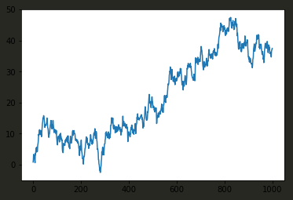

这时候我想改变x轴刻度，最简单就是**set_xticks和set_xticklabels**。后面那个是对标签进行赋值

```python
fig,ax=plt.subplots(1,1)
ax.plot(np.random.randn(1000).cumsum())
ax.set_xticks([0,200,500,750,1000])
ax.set_xticklabels(['one','two','three','four','five'],rotation=30,fontsize='small')
```

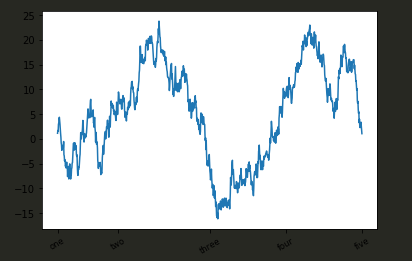

还可以更改title参数和x轴的那啥标签，怎么说，看了就知道

```python
fig,ax=plt.subplots(1,1)
ax.plot(np.random.randn(1000).cumsum())
ax.set_xticks([0,200,500,750,1000])
ax.set_xticklabels(['one','two','three','four','five'],rotation=30,fontsize='small')
ax.set_title('test')
ax.set_xlabel('random')
```

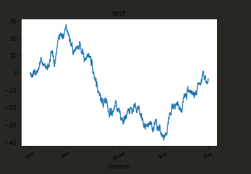

还有一种利用json来设定的方式，这个很重要，很多时候参数很多就可以使用这种方法。

```python
fig,ax=plt.subplots(1,1)
settings={
    'title':"test",
    'xlabel':'random',
}
ax.plot(np.random.randn(1000).cumsum(),linestyle='dashed')
ax.set(**settings)
```

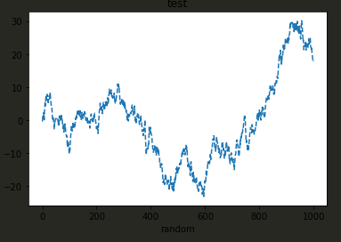

这里要注意的地方很多，**就是这个linestyle只能在plot中设定，set里面不能做这个**

#### 添加图例

因为前面也说过了，图例就是label，在创建每条线的时候记得要添加label，然后记得legend的loc为best

```python
fig,ax=plt.subplots(1,1)
ax.plot(np.random.randn(1000).cumsum(),'k',label='one')
ax.plot(np.random.randn(1000).cumsum(),'k--',label='two')
ax.legend(loc='best')
```

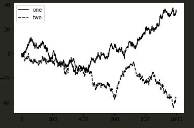

### 注释和子图的加工

在图中可以添加注释。一般我们都会用文本，箭头以及其他形状。可以使用text，arrow和annotate的方法来注释和文本。text在图标上给定的做白哦，根据可选的定制样式绘制文本。

- 介绍一下annotate方法的参数：
  - label：这个就是需要写的内容
  - xy:这个就是那个点的位置
  - xytext:这个就是文本框的位置
  - arrowprops：这个是对箭头的一些设置，是个元组的，很复杂，需要时候，多看文档。

### 图片保存到文件

可以使用plt.savefig来将图片存到文件。这个方法等价于**画布**对象的方法。一般用svg格式，这个矢量的。

```python
fig,ax=plt.subplots(1,1)
ax.plot(np.random.randn(1000).cumsum(),'k',label='one')
ax.plot(np.random.randn(1000).cumsum(),'k--',label='two')
ax.legend(loc='best')
plt.savefig([绝对路径])
```

一些参数:

| 参数                | 描述                                   |
| ------------------- | -------------------------------------- |
| fname               | 保存路径，**（只能用绝对路径，好坑）** |
| dpi                 | 这个是每英寸的像素                     |
| facecolor,edgecolor | 子图之外的背景颜色，默认白色           |
| format              | 格式，这个不常用，一般些路径时候就会用 |
| bbox_inches         | 保存的图片范围                         |

## pandas和seaborn绘图

> pandas生成的Series和DataFrame对象里面是集成了一些matplotlib模块的，可以直接调用绘图。

### 折线图

DataFrame和Series对象自带plot方法，可以直接用于绘折线图

- Series中index做为x轴，当然也可以传入use_index=False来禁用这个功能，也可以用xticks和xlim来进行调整

  ```python
  series=pd.Series(np.random.randn(10).cumsum(),index=np.arange(0,100,10))
  series.plot()
  ```

  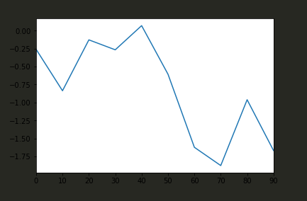

- DataFrame中就较为复杂

  - 直接调用plot会在一张图中汇出所有列对应的图

    ```python
    df=pd.DataFrame(np.random.randn(10,4).cumsum(0),
                    columns=['A','B','C','D'],
                    index=np.arange(0,100,10))
    df.plot()
    ```

    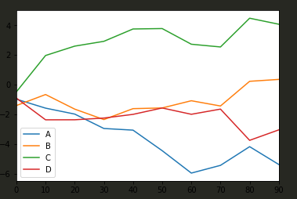

  - 如果想反映在子图中，要传入ax参数，输入子图

    ```python
    fig,axes=plt.subplots(2,2)
    df.plot(ax=axes[0,0])
    ```

    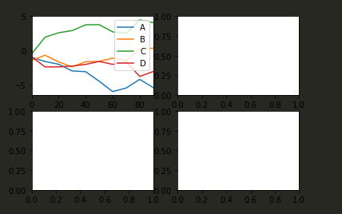

- Series.plot方法参数

  | 参数      | 描述                                          |
  | --------- | --------------------------------------------- |
  | label     | 标签                                          |
  | ax        | 绘图所用的子图对象                            |
  | style     | 样式                                          |
  | alpha     | 图片不透明度                                  |
  | kind      | 可以是area,bar,barh,density,hist,kde,line,pie |
  | logy      | 使用y轴上对数缩放                             |
  | use_index | 使用对象索引刻度标签                          |
  | rot       | 刻度标签的旋转                                |
  | xticks    | x刻度值                                       |
  | yticks    | y刻度值                                       |
  | xlim      | x轴范围                                       |
  | ylim      | y范围                                         |
  | grid      | 展示轴网络                                    |

- DataFrame的plot参数

  | 参数         | 描述                                |
  | ------------ | ----------------------------------- |
  | subplots     | 将每一列绘制在独立的子图中          |
  | sharex       | 如果subplots为True时候，共享X轴刻度 |
  | sharey       | 同理                                |
  | figsize      | 生成图片的尺寸元组                  |
  | title        | 标题                                |
  | legend       | 添加子图图例                        |
  | sort_columns | 按字母顺序绘制各列                  |

### 柱状图

plot.bar()和plot.barh()可以分别绘制垂直和水平的柱状图，默认还是用索引作为自变量。其实就是kind选择而已

```python
fig,axes=plt.subplots(2,1)
data=pd.Series(np.random.rand(16),index=list('abcdefghijklmnop'))
data.plot(kind='bar',alpha=0.7,color='k',ax=axes[1])
```

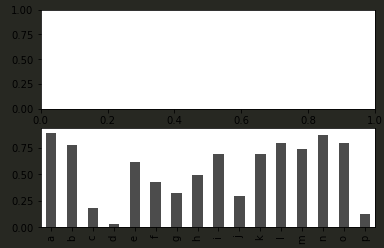

在DataFrame中，每一行的被并为一组，每一列高度会在图上反映出来

```python
df=pd.DataFrame(np.random.rand(6,4),
                index=['one','two','three','four','five','six'],
                columns=pd.Index(['A','B','C','D'],name='Genus'))
df.plot(kind='bar')
```

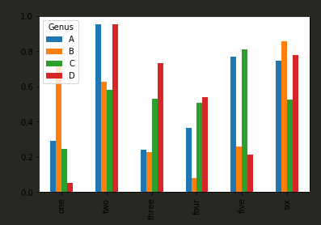

值得注意的是我们的列名称为“Genus”，我们可以用stacked=True来生成堆积的柱状图，一行就会堆叠在一起

```python
df.plot(kind='barh',alpha=0.5,stacked=True)
```

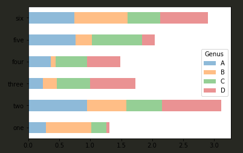

